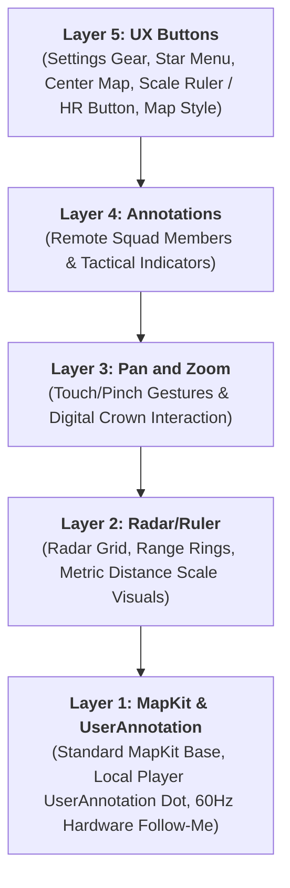

# MapKit Equivalents & Native Behavioral Standards

This document serves as the architectural reference for MapKit integration, visual equivalences, and UX behaviors in RadarMap.

> **CRITICAL ARCHITECTURAL RULE**  
> **NEVER deviate from MapKit native behavior.**

---

## 1. Feature Equivalence Mapping

| Feature | MapKit Native Component | RadarMap Implementation | Code Reference | Key Behavior & Rules |
| :--- | :--- | :--- | :--- | :--- |
| **Me** | Local user dot | Custom local user dot with heading and breathing; can be player icon, commander icon, or X | [`StandardMapView.swift`](file:///Users/cruiser/Documents/antigravity/jolly-hypatia/RadarMap/Views/Map/StandardMapView.swift) [`MemberAnnotationView.swift`](file:///Users/cruiser/Documents/antigravity/jolly-hypatia/RadarMap/Views/Map/MemberAnnotationView.swift) [`SquadTacticalIcons.swift`](file:///Users/cruiser/Documents/antigravity/jolly-hypatia/RadarMap/Views/Map/SquadTacticalIcons.swift) | • Uses SwiftUI `UserAnnotation` to suppress MapKit's default blue dot and replace it with custom tactical vector shapes. • Icon dynamically switches based on role (`SquadLeaderShape` vs `SquadPlayerShape`) or status (`SquadDeadXShape`). • Central core dot pulses (`SquadPulseCore`) at frequency proportional to real-time BPM. |
| **Other players** | Annotations | Custom annotation with heading and breathing; can be player icon, commander icon, or X; fade to gray based on location age | [`StandardMapView.swift`](file:///Users/cruiser/Documents/antigravity/jolly-hypatia/RadarMap/Views/Map/StandardMapView.swift) [`MemberAnnotationView.swift`](file:///Users/cruiser/Documents/antigravity/jolly-hypatia/RadarMap/Views/Map/MemberAnnotationView.swift) | • Rendered via `Annotation(coordinate:anchor: .center)`. • When telemetry is stale (`member.isStale == true`), color turns to `.gray`. • Directional rotation follows heading; center pulse follows teammate BPM. |
| **Tac** | Annotations | Custom tactical annotation (Orders & Enemy markers) | [`TacticalIndicatorOverlayView.swift`](file:///Users/cruiser/Documents/antigravity/jolly-hypatia/RadarMap/Views/Map/TacticalIndicatorOverlayView.swift) | • Rendered via `Annotation`. • Hardware GPU texture cache (`TacticalSpriteCache`). • 5-minute linear fade to grayscale for enemy markers. • Hold-to-delete interaction. |
| **Center map** | Center map | Center map without changing zoom level | [`MapStateMachine.swift`](file:///Users/cruiser/Documents/antigravity/jolly-hypatia/RadarMap/Models/MapStateMachine.swift) [`GameStateManager.swift`](file:///Users/cruiser/Documents/antigravity/jolly-hypatia/RadarMap/Managers/GameStateManager.swift) | • Bottom-left HUD button triggers `gameState.centerMapOnLocalUser()`. • Re-locks `MapTrackingState` to `.locked` at the **current zoom scale** (`scaleMeters` is preserved, never reset). |
| **Gestures** | Gesture | Standard pan/drag, tap, and native pinch-to-zoom gestures | [`StandardMapView.swift`](file:///Users/cruiser/Documents/antigravity/jolly-hypatia/RadarMap/Views/Map/StandardMapView.swift) | • Native `.interactionModes: [.pan, .zoom]` on iOS (`.pan` on watchOS). • Drag gesture transitions state from `.locked` to `.unlocked` (panning). • Pinch to zoom dynamically updates altitude with live Scale Ruler feedback, snapping to discrete `[1, 2.5, 5]` scales on release. • Tap gesture handles indicator placement when menu is pending. |
| **Crown / Pinch Zoom** | Zoom | MapKit zoom with discrete decade levels `[1, 2.5, 5]` | [`AppConstants.swift`](file:///Users/cruiser/Documents/antigravity/jolly-hypatia/RadarMap/AppConstants.swift) [`TacticalRadarMapView.swift`](file:///Users/cruiser/Documents/antigravity/jolly-hypatia/RadarMap/Views/Map/TacticalRadarMapView.swift) [`StandardMapView.swift`](file:///Users/cruiser/Documents/antigravity/jolly-hypatia/RadarMap/Views/Map/StandardMapView.swift) | • Digital Crown rotation (watchOS) or MapKit pinch-to-zoom (iOS) steps through discrete minor scales `[1.0, 2.5, 5.0, 10.0, 25.0, 50.0, 100.0, 250.0, 500.0, 1000.0, 2500.0]`. • Altitude is calculated using MapKit camera FOV trigonometry (`cameraDistance(forScale:)` and `scaleMeters(forCameraDistance:)`). |
| **Other buttons** | *(none)* | Custom definitions not related to MapKit | [`TacticalRadarMapView.swift`](file:///Users/cruiser/Documents/antigravity/jolly-hypatia/RadarMap/Views/Map/TacticalRadarMapView.swift) | • Top-left: Settings Gear. • Top-center: Squad Leader / Commander Menu (`star.fill`). • Bottom-center: Scale Ruler / Hold-to-Act KIA Button. • Bottom-right: Map Style Toggle (Standard MapKit vs OLED Radar). |

---

## 2. Core MapKit Implementation Rules

1. **User Annotation Placement**: Always use `UserAnnotation` in `StandardMapView` for the local user so MapKit coordinates location tracking without double-rendering native blue dots.
2. **Camera Altitude & Aspect Ratio**: MapKit camera altitude is bound to the tactical scale via `StandardMapView.cameraDistance(forScale:)` with FOV tangent trigonometry ($V = 2 \cdot \text{altitude} \cdot \tan(15^\circ)$).
3. **Decade Zoom Progression & Post-Zoom Snapping**: Zoom levels are strictly constrained to the $1 \to 2.5 \to 5$ decade sequence across metric ranges ($1\text{m}, 2.5\text{m}, 5\text{m}, 10\text{m}, 25\text{m}, 50\text{m}, 100\text{m}, 250\text{m}, 500\text{m}, 1000\text{m}, 2500\text{m}$). After ANY zoom change (pinch gesture release, Digital Crown rotation, or automatic zoom adjustments), the system must immediately snap to the nearest discrete decade scale in `[1, 2.5, 5]` and animate the camera to the exact corresponding altitude distance. Zoom levels must never settle on intermediate or arbitrary scales.
4. **Non-Destructive Centering**: Re-centering to the local user resets panning coordinates but strictly retains current camera distance / scale.
5. **Native MapKit Follow-Me Mode (60Hz Smooth Tracking)**: In `StandardMapView`, camera tracking when `trackingState.isLocked` is `true` must use native SwiftUI MapKit `MapCameraPosition.userLocation(fallback: .camera(...))`. This enables MapKit's hardware GPU compositor tracking at 60Hz/120Hz display refresh rate instead of timer-based periodic discrete coordinate refresh steps, while preserving discrete tactical scale altitudes via `cameraBounds` and `MapCamera` fallbacks.
6. **No Side-Effect Interactions**: Elements must strictly perform only their specified UX behavior without side effects. For example, toggling the Map Style button (`selectedMapStyle`) must never alter the map's current centering, tracking lock, or zoom scale.

---

## 3. Map Screen UX Specification

| Element | Does |
| :--- | :--- |
| **Local player icon** | Use standard mapkit `UserAnnotation`, centering method like mapkit native dot - 60hz smooth, NEVER apply refresh on a loop |
| **Configuration btn** | Brings up config menu |
| **Center map btn** | Causes map to center on local user, prefer not to change zoom level, should it change snap to the nearest `[1, 2.5, 5]` |
| **Map style btn** | Cycles between map styles, must preserve centering property, prefer to preserve zoom |
| **HR monitor/kia** | Holding causes local player = `isDead` |
| **Team order** | Brings up team order menu |
| **Crown scroll (watch only)** | Minor scale zoom to decades of `[1, 2.5, 5]` from 1m to 2.5km scale |
| **Pinch (phone only)** | Standard mapkit zoom, snap back to decades of `[1, 2.5, 5]` after release |
| **Ruler/Radar** | Displays map zoom scale not the desired zoom |
| **Scale snap** | Snap back to decades of `[1, 2.5, 5]` after any automatic or manual zoom operation, must not impact follow me mode |
| **Map pan** | Standard mapkit pan, map no longer centers on local user |

> **STRICT UX PRINCIPLE**  
> The UX must not apply any additional behaviors than what’s described. For example, the map style button should not cause a change to map centering behavior.

---

## 4. UX Layers Architecture

| Layer | Component | Description & Responsibilities |
| :--- | :--- | :--- |
| **Layer 5 (Top)** | **UX Buttons** | Floating HUD buttons: Settings gear, Star menu, Center Map, Hold-to-Act KIA / Scale Ruler, and Map Style toggle. Intercepts taps and holds with top priority. |
| **Layer 4** | **Annotations** | Dynamic tactical markers (remote squad teammates, orders, hostile alerts) rendered on geographic coordinates above map content. |
| **Layer 3** | **Pan and zoom** | Gesture recognition layer: drag/pan to inspect, pinch-to-zoom (iOS), Digital Crown (watchOS). |
| **Layer 2** | **Radar/ruler** | Radar range rings, grid divisions, and metric scale ruler visuals representing map zoom scale. |
| **Layer 1 (Bottom)** | **MapKit & `UserAnnotation`** | Native MapKit engine and local player `UserAnnotation` vector icon with 60Hz hardware compositor tracking. |

