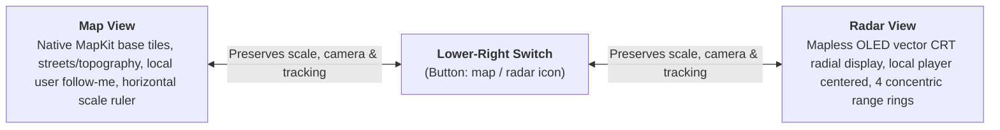

# Tactical UI & Radar Specification (Map, Radar & Visual Systems)

This document is the authoritative design and implementation specification for the user interface, interaction semantics, scale models, and platform adapters of **Radar Map** (watchOS & iOS).

---

## 📋 Table of Contents

* [Key Constants & Configuration Reference](#-key-constants--configuration-reference)
1. [Product Model & Two-Presentation Architecture](#1-product-model--two-presentation-architecture)
2. [Non-Negotiable Motion Rules (60Hz Native Tracking)](#2-non-negotiable-motion-rules-60hz-native-tracking)
3. [Canonical Scale Semantics & The Discrete Ladder](#3-canonical-scale-semantics--the-discrete-ladder)
4. [Tactical Radar View Specification](#4-tactical-radar-view-specification)
5. [Platform-Specific Map Adapters (iOS vs. watchOS)](#5-platform-specific-map-adapters-ios-vs-watchos)
6. [HUD Controls, Gestures & Centering Semantics](#6-hud-controls-gestures--centering-semantics)
7. [Visual Styling, Themes & Layers Hierarchy](#7-visual-styling-themes--layers-hierarchy)
8. [Code Audit & Verification Checklist](#8-code-audit--verification-checklist)

---

## ⚡ Key Constants & Configuration Reference

The following centralized constants from [`AppConstants.swift`](RadarMap/AppConstants.swift) and [`TacticalScalePolicy.swift`](RadarMap/Models/TacticalScalePolicy.swift) govern all tactical presentation, geometry, timing, and HUD calculations:

| Section & Domain | Constant / Property | Value / Definition | Purpose & Behavioral Impact |
| :--- | :--- | :--- | :--- |
| **§1 Presentations** | `TacticalPresentation` | `.map` vs `.radar` | Top-level visual layout switch; strictly preserves camera, scale, and tracking |
| **§2 Motion & Tracking** | Hardware Compositor Rate | `60Hz` (watchOS) / `120Hz` (iOS) | Native MapKit `showsUserLocation` / `UserAnnotation` follow-me refresh rate |
| **§2 Motion & Tracking** | `centerThresholdMeters` | `10.0m` (`AppConstants.Location`) | Deadband threshold before map transitions from local follow to free-roam pan |
| **§3 Tactical Scales** | `defaultScale` | `50.0m` (`TacticalScalePolicy`) | Baseline minor scale on initial room entry or cold boot |
| **§3 Tactical Scales** | `standardAllowedScales` | `[1, 2.5, 5, 10, 25, 50, 100, 250, 500, 1000, 2500]` m | Canonical discrete logarithmic decade scale ladder |
| **§3 Tactical Scales** | Scale Range Bounds | `1.0m` min / `2,500.0m` max | Clamping boundaries for Digital Crown and pinch-to-zoom |
| **§4 Radar Geometry** | `rangeRingRatios` | `[0.25, 0.50, 0.75, 1.0]` (`RadarScale`) | Radial multipliers for 4 concentric rings ($S, 2S, 3S, 4S$) |
| **§4 Radar Geometry** | `radarRadiusRatio` | `0.44` (`RadarScale`) | Outer ring radius as fraction of minimum screen dimension |
| **§4 Radar Geometry** | Outer Ring Gating | $d > 4 \times S$ | Strict out-of-range cutoff; entities beyond $4S$ are dropped |
| **§4 Radar Geometry** | `radarUIHz` | `20.0 Hz` (50ms interval) | Vector CRT sweep and target rendering refresh frequency |
| **§5 Map Adapters** | Camera FOV Half-Angle | `15.0°` (`30.0°` total FOV) | Tangent factor: $\text{altitude} = \frac{\text{visibleMetersLat}}{2 \cdot \tan(15^\circ)}$ |
| **§5 Map Adapters** | Aspect Ratio ($H/W$) | `1.22` (watchOS) / `2.16` (iOS) | Screen vertical-to-horizontal ratio for coordinate span conversions |
| **§5 Map Adapters** | `metersPerDegreeLatitude` | `111,139.0m` (`Location`) | WGS-84 geodesic latitude conversion factor |
| **§6 HUD & Gestures** | `actionHoldDurationSeconds` | `1.2s` (`Gestures` / `DeathHold`) | Press-and-hold duration on Scale Ruler to toggle KIA flatline |
| **§6 HUD & Gestures** | Scale Ruler Width | `19pt` bar / `40pt` box (watchOS); `40pt` / `40pt` (iOS) | Physical metric scale indicator dimension |
| **§6 HUD & Gestures** | Circle Hitbox Size | `48 × 48 pt` (watchOS) / `68 × 68 pt` (iOS) | Symmetrical corner interactive touch target dimensions |
| **§6 HUD & Gestures** | Rect Hitbox Size | `52 × 48 pt` (watchOS) / `112 × 64 pt` (iOS) | Bottom ruler / center button touch target dimensions |
| **§7 Indicators & Lifetimes** | `enemyIndicatorFadeDurationSeconds` | `300.0s` (5 minutes) (`Subscription`) | Linear opacity fade-to-grayscale for enemy markers |
| **§7 Indicators & Lifetimes** | Marker Frame Size | `26.0pt` (watchOS) / `32.0pt` (iOS) | Visual bounding box for tactical indicators and annotations |

---

## 1. Product Model & Two-Presentation Architecture

Radar Map delivers a tactical companion experience across two **top-level visual presentations**:



### Invariants & Product Decisions:
* **Two Presentations, Not Modes:** The app has Map view and Radar view. The lower-right button switches between them. It is **not** a map-style control and does **not** introduce separate camera tracking modes.
* **No Artificial Mode Badges:** Do not create user-facing "Follow Mode", "Browse Mode", or "Tactical Scale Mode" labels or state machines. Map view behaves like a standard, high-grade navigation map.
* **Non-Destructive Presentation Switching:** Switching between Map and Radar views **must preserve**:
  * `selectedScaleMeters`
  * Active MapKit camera altitude and center coordinates
  * Heading state and tactical indicator selection
  * Roster and member vitals
  Switching to Radar view must not destroy the MapKit camera; switching back to Map view must not trigger re-bootstrap or camera resets.

---

## 2. Non-Negotiable Motion Rules (60Hz Native Tracking)

> **CORE MANDATE:** Neither the visible map camera nor the local player marker may visibly step, teleport, or chase individual 1 Hz GPS samples on phone or Apple Watch.

### Prohibited Motion Anti-Patterns:
1. **No 1 Hz Teleportation:** Do not update camera center, heading, or local marker coordinates in `didUpdateLocations`, `$location` sinks, or `onChange(of: location)`.
2. **No Artificial App Interpolation:** Do not wrap GPS coordinate updates in `withAnimation(.linear(duration: 1.0))` to glide the camera between samples. Native MapKit GPU tracking already handles continuous motion.
3. **No DisplayLink Camera Writers:** `CADisplayLink` must **never** write camera center, altitude, or annotation coordinates. (It is permitted exclusively to read presentation geometry for live ruler rendering during active pinch gestures).
4. **No Timer Follow Loops:** Do not use `Timer`, `DispatchSourceTimer`, recurring `Task.sleep`, or `asyncAfter` retry loops to recover camera follow state.
5. **No Synthetic Local Markers:** Do not create a synthetic annotation driven by raw GPS coordinates. Local player position must be owned natively by MapKit (`showsUserLocation = true` on iOS; `UserAnnotation` on watchOS).

---

## 3. Canonical Scale Semantics & The Discrete Ladder

The application operates on a single product-level state:
```swift
@Published public var selectedScaleMeters: CLLocationDistance = 50.0
```

### What `selectedScaleMeters` Means:
* **In Map View:** The real-world ground distance represented by the displayed **horizontal scale ruler bar**.
* **In Radar View:** The real-world ground distance between **each adjacent range ring** (outer radar range $= 4 \times S$).
* **What it does NOT mean:** It does not mean camera altitude, full viewport width, or raw diagonal camera distance. Camera altitude is an internal calibration value derived via tangent trigonometry:
  $$\text{altitude} = \frac{\text{outerRadarMeters}}{\text{radarRadiusRatio}} \times \frac{\text{aspectRatio}}{2 \cdot \tan(15^\circ)}$$

### The Canonical Scale Ladder (`TacticalScalePolicy`):
Scale steps are constrained to the discrete ladder:
```swift
public static let standardAllowedScales: [CLLocationDistance] = [
    1, 2.5, 5, 10, 25, 50, 100, 250, 500,
    1_000, 2_500
]
```
* **Startup Default Scale:** **50 meters**.
* **Minimum Scale:** 1 meter.
* **Maximum Scale:** 2.5 kilometers.
* **Logarithmic Snapping:** Snapping to the ladder uses logarithmic distance minimization:
  $$\text{target} = \arg\min_s \left| \ln\left(\frac{s}{\text{observedScale}}\right) \right|$$
* **Bounded Stepping:** `nextScale()` and `previousScale()` clamp at the boundary limits; they never wrap around.

---

## 4. Tactical Radar View Specification

Radar view is an OLED-optimized, mapless radial vector display centered on the local operator.

```
                  [000° N]
                     |
               . - - 4S - - .
           . '       |       ' .
         /       . - 3S - .      \
        /      /     |     \      \
       |      |   . -2S-.   |      |
 [270° W]-----|---|-(+) |---|----[090° E]
       |      |   ' -S- '   |      |
        \      \     |     /      /
         \       ' - - - '       /
           ' .       |       . '
               ' - - - - - '
                     |
                  [180° S]
```

### Radar Geometry & Projection Equations:
* **Concentric Rings:** Exactly 4 range rings with labels $S, 2S, 3S, 4S$.
  * At $50\text{m}$ scale: rings are $50\text{m}, 100\text{m}, 150\text{m}, 200\text{m}$ (outer range $= 200\text{m}$).
  * At $100\text{m}$ scale: rings are $100\text{m}, 200\text{m}, 300\text{m}, 400\text{m}$ (outer range $= 400\text{m}$).
* **Target Projection:** Given ground distance $d$, selected scale $S$, outer ring radius $R_\text{outer}$, and bearing $\theta$:
  $$D_\text{outer} = 4S$$
  $$r_\text{screen} = \frac{d}{4S} R_\text{outer}$$
  $$\Delta x = r_\text{screen} \cdot \sin(\theta),\qquad \Delta y = -r_\text{screen} \cdot \cos(\theta)$$
* **Strict Out-of-Range Gating:**
  $$\text{Render Target} \iff d \le 4S$$
  Entities beyond $4S$ are **never rendered**. Do not clamp them to the perimeter ring, draw edge arrows, or auto-zoom the radar.

---

## 5. Platform-Specific Map Adapters (iOS vs. watchOS)

Due to structural differences between iOS 17+ SwiftUI MapKit and watchOS, the app employs platform-tailored adapters sharing a unified domain core:

### A. iPhone / iPad Adapter (`TacticalMKMapView.swift`)
* **Architecture:** `MKMapView` wrapped inside SwiftUI `UIViewRepresentable`.
* **Native Follow:** Governed by `showsUserLocation = true` and `userTrackingMode = .follow`.
* **Camera State Coordinator (`TacticalPhoneCameraState`):**
  * `desiredAltitude`: Calibrated altitude corresponding to `selectedScaleMeters`.
  * `isApplyingProgrammaticCameraChange`: Guards against delegate feedback loops.
  * `didObservePinch`: Differentiates pinch-to-zoom gestures from map panning.
* **Pinch-to-Zoom & Spring Snap:**
  * Free gesture zoom during active pinch; the scale ruler updates in real time via `CADisplayLink` reading map point geometry.
  * On pinch release: Measures actual ground distance represented by the ruler bar, snaps to `nearestAllowedScale(to:)`, and executes a single zoom-only spring animation preserving center and tracking.
* **Idempotent Updates:** `updateUIView` updates annotations and theme only when changed; it never sets camera center or triggers follow recovery on unrelated state updates.

### B. Apple Watch Adapter (`StandardMapView.swift`)
* **Architecture:** Native SwiftUI `Map` with `UserAnnotation(coordinate:)`.
* **Digital Crown Zoom:**
  * Attached via `CrownInputView.swift` / `digitalCrownRotation`.
  * Each discrete notch steps up/down the `TacticalScalePolicy` ladder.
  * Haptic click (`WKInterfaceDevice.current().play(.click)`) triggers only when the scale selection actually changes.
* **Location Source Handling:** Preserves watchOS's built-in system selection (automatically sourcing GPS from the paired iPhone when nearby and falling back to Watch GPS standalone).

---

## 6. HUD Controls, Gestures & Centering Semantics

### Floating HUD Controls (Layer 5):

| Control | Position | Icon | Action & Semantics |
| :--- | :--- | :--- | :--- |
| **Settings** | Top-Left | `gearshape.fill` | Opens configuration: callsign, squad management, radar colors, and legal policies. |
| **Tactical Orders** | Top-Center | `star.fill` | Opens tactical order menu: place rally points, enemy warnings, and squad objectives. |
| **Center Map** | Bottom-Left | `location.fill` | Re-locks tracking to local user (`.locked`). **Strictly preserves active scale/altitude** (never resets to 50m). |
| **Scale Ruler / Vitals** | Bottom-Center | `waveform.path.ecg` | Displays active metric ruler. Press & hold for 1.2s to toggle local KIA / Downed flatline state. |
| **Map / Radar Switch** | Bottom-Right | `map` / `circle.dashed` | Toggles between Map view and OLED Radar view. Preserves scale, annotations, and camera state. |

### Centering Semantics:
* Tapping **Center Map** restores native follow-me tracking.
* It must **never** reset the camera zoom to the default 50m scale.
* It must **never** start a periodic timer loop to drag the camera.

---

## 7. Visual Styling, Themes & Layers Hierarchy

### 5-Layer UI Compositor Architecture:
```
Layer 5 (Top):    Floating HUD Buttons (Settings, Orders, Center, Vitals, Style Switch)
Layer 4:          Dynamic Annotations (Teammates, Hostiles, Objective Markers)
Layer 3:          Gesture Handling (Pan, Pinch-to-Zoom, Digital Crown Input)
Layer 2:          Visual Overlay (Radar Range Rings, Crosshairs, Scale Ruler Bar)
Layer 1 (Bottom): MapKit Native Compositor (Vector Tiles, Native 60Hz User Follow Dot)
```

### Visual Styling Rules:
* **Dark-First Appearance:** UI is designed for dark environments (tactical NVG / OLED contrast).
* **Radar Color Themes (`RadarColorTheme`):** Supports high-visibility **Green** and high-contrast **Red**.
* **Muted Base Cartography:** In Map View, streets and elevations are rendered with low emphasis (`.standard(elevation: .flat, pointsOfInterest: .excludingAll)`) to maximize readability of tactical vector blips and orders.

---

## 8. Code Audit & Verification Checklist

When reviewing or refactoring UI components, ensure:
- [ ] No `CADisplayLink` writes camera or annotation coordinates.
- [ ] No `Timer` or polling loop moves the local user or camera.
- [ ] Tapping "Center Map" retains current zoom distance.
- [ ] Map ↔ Radar presentation switch retains zoom scale and camera state.
- [ ] Radar view strictly hides targets beyond $4 \times \text{selectedScaleMeters}$.
- [ ] Pinch gesture release snaps cleanly to the nearest discrete decade scale.
- [ ] Digital Crown rotation triggers haptic feedback only when scale index changes.
