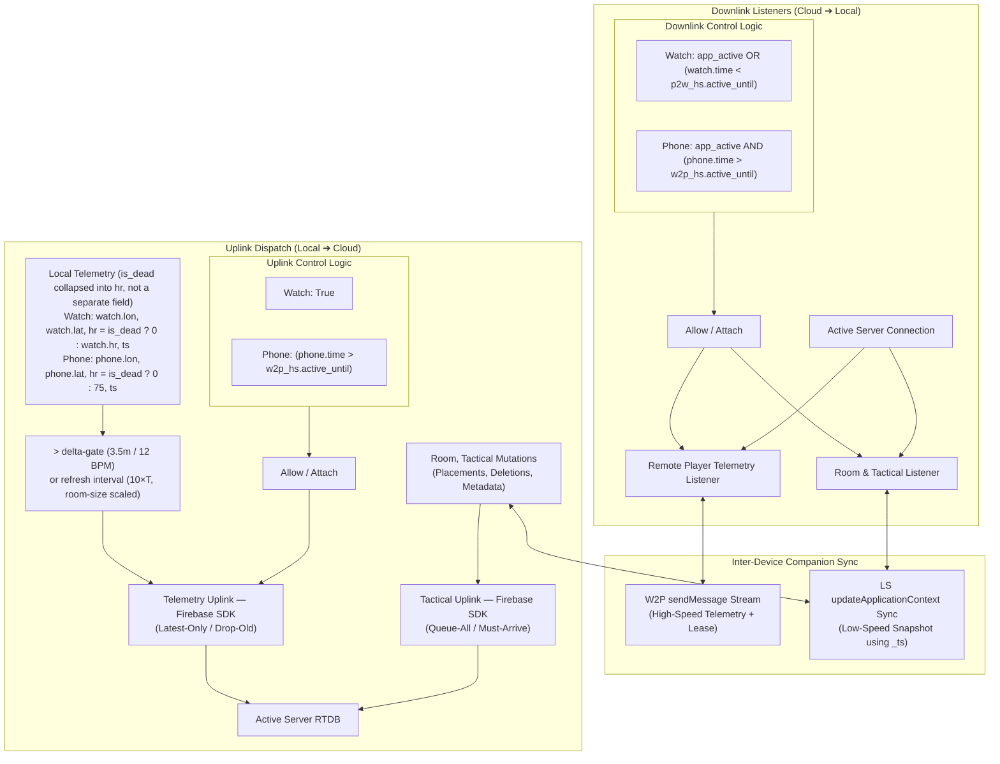

# Cloud Data Management Architecture

This document formalizes the **Watch-Centric Cloud Data Management Matrix** and **Client-Side Upload Scheduling Architecture** governing data flow between local companion systems (`WCSession` / local state) and Cloud infrastructure (Firebase Real-Time Database / Cloud Functions).

---

## ⚡ Key Cloud Architecture Constants

The following centralized constants from [`AppConstants.swift`](../RadarMap/AppConstants.swift) govern cloud data synchronization, delta gating, bandwidth adaptation, and background cleanup:

| Section & Domain | Constant / Identifier | Value | Architectural Scope & Impact |
| :--- | :--- | :--- | :--- |
| **§1 Matrix / Endpoints** | RTDB Endpoints | `/r` (rooms), `/p` (telemetry), `/t` (tactical), `/m` (members) | Shortened path keys (`Network.Endpoints`) |
| **§2 Flow & Gating** | `maxPredictedPositionErrorMeters` | `3.5m` (`Timing.DeltaGating`) | Max dead-reckoning extrapolation divergence before triggering send |
| **§2 Flow & Gating** | `minHeartRateDeltaBpm` | `12.0 BPM` (`Timing.DeltaGating`) | Heart rate change threshold for biometric delta gating |
| **§2 Flow & Gating** | `heartRateDeltaGatingEnabled` | `false` (`Timing.DeltaGating`) | When false, HR is passive and does not trigger unneeded GPS uploads |
| **§2 Lease Control** | `activeUntilLeaseDurationSeconds`| `5.0s` (`WatchConnectivity`) | Foreground companion heartbeat lease duration |
| **§2 Lease Control** | `activeAdvertisementCadenceSeconds`| `1.0s` (`WatchConnectivity`) | Cadence for refreshing companion activity lease |
| **§3 Scheduling** | Tactical Indicator Cap | `0` (Free) / `20` (Pro) (`Subscription`) | Maximum concurrent enemy/environment tactical indicators (`mti`) |
| **§3 Scheduling** | Enemy Indicator Decay | `300.0s` (5 minutes) (`Subscription`) | Automated fade-out duration for placed enemy markers |
| **§4 Bandwidth Adaptation**| `playerThreshold` | `12` players (`ConstantBandwidth`) | Player count ceiling before dynamic update rate reduction begins |
| **§4 Bandwidth Adaptation**| `baselineMaxUpdateRateHz` | `1.0 Hz` ($T = 1.0\text{s}$) | Base telemetry update frequency when $P \le 12$ |
| **§4 Bandwidth Adaptation**| Scaled Rate Formula ($P > 12$) | $1.0 \times (12 / P)\text{ Hz}$ | Keeps total aggregate upload bandwidth flat at $12\text{ packets/s}$ |
| **§4 Fallback Heartbeat** | `refreshIntervalMultiplier` | `10.0` ($10 \times T$) (`ConstantBandwidth`) | Fallback heartbeat cadence when player is stationary / delta-gated |
| **§4 Stale Telemetry** | `staleTimeoutMultiplier` | `15.0` ($15 \times T$) (`ConstantBandwidth`) | Stale peer threshold before fading icon to gray on radar |
| **§5 Cleanup & TTL** | `idleCutoffHours` | `12.0` hours (43,200s) (`Inactivity`) | Idle-room cutoff; host refreshes `exp` hourly to keep an active room alive past this |
| **§6 Network Latency** | Quality Boundaries | `150ms` (Exc), `300ms` (Good), `700ms` (Poor) | `Network.Quality` latency threshold grading |

---

> [!CAUTION]
> **Cardinal Invariant: WCSession Purpose & Firebase Decoupling**
> `WCSession` is strictly and exclusively for local **Phone-to-Watch** companion transport. It must **NEVER** be conflated with or gated upon Firebase cloud connectivity or room sessions. Companion presence leasing (`active_until`) and state sync run continuously whenever the companion devices are active, offline or online.

## 1. Cloud Data Management Matrix

| | **From: Local Data** | **From: Cloud (Firebase RTDB)** |
|---|---|---|
| **To: Local Data** | **Resilient WCSession:**<br>• `WCSession.sendMessage` for high-speed live stream & `active_until` lease<br>• `WCSession.updateApplicationContext` for low-speed state snapshots<br>• Timestamp-driven merge resolution (`*_ts` per structure, Watch wins tie-breaks)<br>• Directional payloads (`p2w_hs`, `w2p_hs`, `p2w_ls`, `w2p_ls`) | **Persistent Realtime Streaming Listeners (Downstream) — Firebase SDK (Plan of Record; see §5.B):**<br>• All three downstream feeds (telemetry, tactical, room) use native `FirebaseDatabase` SDK listeners, not REST polling or REST/SSE<br>• Dedicated streaming listeners on active cloud client, multiplexed over one SDK-managed WebSocket connection<br>• Monotonic sequence and timestamp watermarks reject out-of-order packets<br>• **Watch is primary cloud client** (attaches listeners); Phone consumes `w2p_hs` stream and only attaches cloud listeners if Watch expires (`phone.time > w2p_hs.active_until`)<br>• SDK automatically resynchronizes state after reconnect via `.info/connected` — no manual repair logic |
| **To: Cloud (Firebase RTDB)** | **Split Upload Scheduling Policies (Upstream) — Firebase SDK (Plan of Record; see §5.C):**<br>• Writes dispatch via native `FirebaseDatabase` SDK methods (`setValue`/`updateChildValues`) over the same shared connection as the downstream listeners, not REST<br>• **Tactical Writes (Queue-All / Must-Arrive):** Placements, deletions bypass delta-gating and are submitted immediately; offline writes are queued by the SDK and replayed in order upon reconnect.<br>• **Telemetry Uploads (Latest-Only / Drop-Old):** Delta-gated ($> 3.5\text{ m}$; HR is passive when `heartRateDeltaGatingEnabled = false`) or fallback refresh interval ($10 \times T$). Connected: immediate write. Disconnected: coalesces into a single in-memory pending slot (app-level, independent of the SDK's own offline queue — see §5.C caveat); flushes only the latest sample upon reconnect.<br>• Cloud writes tolerate occasional duplicate or overlapping attempts — latest data wins | **Hourly cleanup based on `exp`, plus server-enforced room cap & client-enforced tactical cap:**<br>• Scheduled Cloud Function (`cleanExpiredRooms`) purges expired rooms and associated data across `/r`, `/t`, and `/p`<br>• Event-triggered `cleanupEmptyRoom` purges rooms upon host departure or 0 members, and enforces the room capacity cap (`cap`, max 12) by purging excess members and their `/p/{roomId}` telemetry<br>• Client-side deterministic eviction (pre-add eviction + post-sync sweep) bounds `/t/{roomId}/i` to `mti` (see §7.B) |

---

## 2. Integrated Control & Data Flow Architecture

The same unified architecture applies to both Apple Watch and iPhone with differentiated control logic:



---

## 3. Client-Side Upload Scheduling Policies

### Policy 1: Tactical Writes (Queue-All / Must-Arrive)
* **Scope:** Tactical indicator placements and deletions, split into two sibling branches by category (see §7.B): squad orders at `/t/{roomId}/o/{indicatorId}` (self-pruning, no shared cap) and enemy+environment indicators at `/t/{roomId}/i/{indicatorId}` (shared cap `mti`, client-enforced via pre-add eviction and post-sync sweeps; see §7.B). Deletes are issued against both branches unconditionally, since the delete call site has no category to route by.
* **Execution:** All tactical mutations are submitted directly to the Firebase SDK without dropping or collapsing actions.
* **Offline Resilience:** When offline, writes remain queued by the SDK's own offline write queue and are replayed in order upon reconnect — this policy is a natural fit for that default SDK behavior (see §5.C).
* **Preservation:** Guarantees indicator IDs, ordering, deletion tombstones, and completion handlers are preserved intact.

### Policy 2: Telemetry Writes (Latest-Only / Drop-Old)
* **Scope:** High-frequency GPS coordinates and biometrics (`/p/{roomId}/{memberId}.json`).
* **Pre-Uplink Gating:** Evaluated by Dead Reckoning & Delta Gating (movement $\ge 3.5\text{ m}$ or $\Delta\text{HR} \ge 12\text{ BPM}$, with fallback refresh heartbeat interval $10 \times T$).
* **Connection Gating & Coalescing:**
  * **Connected:** Dispatches the compact 4-element array `[lat, lon, hr, ts]` immediately at the active update cadence.
  * **Disconnected / Offline:** Network write calls are bypassed. The system maintains exactly **one** in-memory `PendingTelemetry` slot. Subsequent offline samples replace/coalesce older samples, eliminating unbounded retry queues and packet stampedes.
  * **Reconnect Flush:** On connection restoration (disconnected $\rightarrow$ connected transition), exactly **one** telemetry write containing the latest pending state is transmitted. The pending slot is cleared only upon successful write completion.

---

## 4. Heartbeat Rate & Telemetry Adaptation Schedule

### Constant Aggregate Bandwidth Scaling Equation
To hold aggregate fan-out bandwidth **constant** ($P \times R(P) = R_{\text{base}} \cdot N_{\text{threshold}}$, independent of $P$) once player count exceeds the threshold:

$$R(P) = \begin{cases} R_{\text{base}} & P \le N_{\text{threshold}} \\ R_{\text{base}} \cdot \dfrac{N_{\text{threshold}}}{P} & P > N_{\text{threshold}} \end{cases} \qquad T(P) = \frac{1}{R(P)}$$

* **Constants:** $R_{\text{base}} = 1.0\text{ Hz}$, $N_{\text{threshold}} = 12$, $X = 10$, $Y = 15$.
* **Peak Rate / Min Interval ($T$):** Minimum update interval under congestion; provides a floor to prevent over-congestion.
* **Refresh Interval ($X \times T$):** Default refresh heartbeat to assure cloud data freshness when stationary.
* **Stale Timeout ($Y \times T$):** Timeout after which associated player graphics turn gray, indicating staleness.
* **Why linear, not squared:** $R(P)$ must fall off as $1/P$ — not $1/P^2$ — for aggregate bandwidth $P \times R(P)$ to stay constant rather than continue shrinking as the room grows past the threshold. A squared falloff is a *stricter, decreasing* aggregate-bandwidth policy, not an *identical* one; it was evaluated and rejected in favor of the equation above, which is the plan of record.
* **Tier Boundary:** Pro tier is capped to **12 players** for production sessions today. The equation itself is general and well-defined for any $P > N_{\text{threshold}}$ — the 12-player cap is a current product decision, not a limitation of the equation, and is expected to lift for a future Extended tier.
* **Network-quality floor:** the $P$-based interval above is additionally floored (never sped up, only ever slowed down) by connection quality — `AppConstants.Timing.AdaptiveRate.criticalInterval` (5.0s) and `.poorInterval` (4.0s) — via `max(floorInterval, calculatedInterval)` in `GameStateManager.recalculateAdaptiveUploadInterval()`. A `critical`/`offline` grade floors to 5.0s, `poor` floors to 4.0s, and `good`/`excellent` pass the $P$-based interval through unmodified. This floor applies only to the outbound upload interval — never to whether this device is wrist-active (see §4 note in COMPANION_DATA_SYNC_MODEL.md: upload rate is independent of `isWristActive`).

| Player Count ($P$) | Tier | Peak Allowed Rate ($R(P)$) | Min Update Interval ($T$) | Refresh Interval ($10 \times T$) | Stale Timeout ($15 \times T$) |
| :---: | :---: | :---: | :---: | :---: | :---: |
| **1 – 4** | **Free Tier** (Max 4) | **$1.0\text{ Hz}$** | $1.0\text{ s}$ | $10.0\text{ s}$ | $15.0\text{ s}$ |
| **5 – 12** | **Pro Tier** (Max 12) | **$1.0\text{ Hz}$** | $1.0\text{ s}$ | $10.0\text{ s}$ | $15.0\text{ s}$ |
| **16** | Extended | **$0.75\text{ Hz}$** | $1.33\text{ s}$ | $13.3\text{ s}$ | $20.0\text{ s}$ |
| **20** | Extended | **$0.60\text{ Hz}$** | $1.67\text{ s}$ | $16.7\text{ s}$ | $25.0\text{ s}$ |
| **24** | Extended | **$0.50\text{ Hz}$** | $2.0\text{ s}$ | $20.0\text{ s}$ | $30.0\text{ s}$ |
| **50** | Extended (Max) | **$0.24\text{ Hz}$** | $4.17\text{ s}$ | $41.7\text{ s}$ | $62.5\text{ s}$ |

Every row satisfies $P \times R(P) = 12$ for $P > 12$ (e.g. $16 \times 0.75 = 20 \times 0.60 = 24 \times 0.50 = 50 \times 0.24 = 12$), confirming aggregate bandwidth is held at the Pro-tier ceiling rather than continuing to shrink.

---

## 5. Channel Breakdown & Implementation Details

### A. Local Data ➔ Local Data (WCSession)
* **Components:** [`WatchConnectivityManager.swift`](../RadarMap/Managers/WatchConnectivityManager.swift), [`CompanionSyncModels.swift`](../RadarMap/Models/CompanionSyncModels.swift), [`COMPANION_DATA_SYNC_MODEL.md`](COMPANION_DATA_SYNC_MODEL.md).
* **Guarantees:** Resilient local synchronization between iPhone and Apple Watch using directional snapshots and per-structure timestamp resolution (`*_ts`).
* **Mechanism:** High-speed stream via `WCSession.sendMessage` (falling back to `updateApplicationContext` when unreachable) and low-speed snapshots via `WCSession.updateApplicationContext`. Watch wins equal-timestamp ties. Rolling `sync_ts` retransmission is **deliberately not** gated on `WCSession.isReachable` — see [`COMPANION_DATA_SYNC_MODEL.md §3`](COMPANION_DATA_SYNC_MODEL.md#3-merge-engine--conflict-resolution-rules) for why: `isReachable` only reflects live-messaging availability (foreground / high-priority background) and is known to read `false` even during an active Watch workout session, while `updateApplicationContext` is designed to keep working regardless of reachability via the system WatchConnectivity daemon. Gating on it was tried and reverted — it risks silently stalling sync to a backgrounded-but-active companion for a negligible power saving.
* **`*_ls` vs `*_hs` are structurally different channels, not two flavors of one pattern** — see [`COMPANION_DATA_SYNC_MODEL.md §0`](COMPANION_DATA_SYNC_MODEL.md#0-two-structurally-different-channels--do-not-cross-the-streams). `*_ls` is a bidirectionally-shared, timestamp-merged variable with `WatchConnectivityManager.localLS` as the single source of truth on each device (no `GameStateManager` shadow copies). `*_hs` (`p2w_hs`/`w2p_hs`) is two independent one-way streams — single writer, single reader, no merge — and its HR/telemetry-source consumption rules (§2 of that doc) key off the exact same `active_until` comparison as the cloud-client role decision below, not an independent check.

---

### B. Cloud ➔ Local Data (Realtime Streaming Listeners)
* **Components:** [`FirebaseSyncManager.swift`](../RadarMap/Managers/FirebaseSyncManager.swift).
* **Gated Listener Attachment:** `GameStateManager.evaluateListenerGate()` runs on both platforms with differentiated logic (independent of the Uplink/ownership gate in §5.B below). It requires an active tactical session, then attaches based on platform role:
  * **Watch:** `app_active OR (watch.Time < p2w_hs.active_until)` (`appActive || peerLeaseActive`).
  * **Phone:** `app_active AND (phone.time > w2p_hs.active_until)` (`appActive && !peerLeaseActive`). The Phone only attaches listeners when looking at the app AND the Watch has stepped down / its lease expired.

#### Plan of Record: Transport Decision (Firebase SDK, not REST/SSE)
* **Decision:** All three downstream channels — Remote Player Telemetry, Tactical Indicators, and Room/Membership — **must** be implemented using the native Firebase Realtime Database SDK's realtime listeners (`DatabaseReference.observe(.value)` / `.childAdded` / `.childChanged` / `.childRemoved`), not the RTDB REST API in either plain-polling or `Accept: text/event-stream` (SSE) form.
* **Rationale:**
  * **Wire-level delta payload is equivalent either way** — the SDK's listener protocol and REST SSE both stream the same underlying `put`/`patch` change events from the RTDB backend, so per-event payload size does not differ meaningfully between the two transports.
  * **Connection multiplexing favors the SDK for this app specifically.** This app requires three concurrent downstream feeds. The SDK multiplexes all listeners over a single persistent WebSocket connection (one TCP+TLS handshake, one keepalive stream). REST SSE has no equivalent multiplexing — each streamed path is its own independent HTTP connection, so three SSE streams cost three separate handshakes and three concurrent keepalive overheads. Under otherwise-identical link conditions, the SDK is the lower-aggregate-bandwidth option for our 3-stream case.
  * **Automatic reconnect + repair is a first-class SDK guarantee, not something REST/SSE provides for free.** The SDK watches connection state via `.info/connected`, retries with backoff on drop, and automatically resynchronizes every attached listener to the server's current state on reconnect — no app-level "give me everything since sequence N" logic required. A REST/SSE stream drop must be detected, repaired via a manual REST GET, and re-attached by hand, which re-implements the exact behavior the SDK gives natively.
  * Matches the "Future Proof" requirement to depend on the Firebase SDK rather than reinvent its reconnect/resync behavior in application code.
* **Current implementation status: COMPLIANT.** `firebase-ios-sdk` is an SPM dependency (both `RadarMap.xcodeproj` via `generate_xcodeproj.py` and `Package.swift`), and all three downstream channels are implemented on top of it via the `RTDBTransport` protocol ([RTDBTransport.swift](../RadarMap/Managers/RTDBTransport.swift)), whose production implementation `FirebaseRTDBTransport` wraps `DatabaseReference`. `FirebaseSyncManager.startTelemetryPolling(roomId:)` / `stopTelemetryPolling()` are the gated attach/detach entry points, called from `GameStateManager.evaluateListenerGate()` (see the Gated Listener Attachment bullet above), calling `attachRealtimeListeners(roomId:)` / `detachRealtimeListeners()`: telemetry uses `.childAdded` / `.childChanged` / `.childRemoved` on `p/{roomId}` (per-child deltas, not whole-subtree re-transmission), tactical and room/membership each use `.value` on `t/{roomId}` / `r/{roomId}` (matching their existing whole-node merge semantics). Since these listeners fire immediately on attach with current state and again on every subsequent change, `startTelemetryPolling` does not also perform a separate instant one-shot fetch (see §7.C — that redundant REST-era fetch was removed). `fetchRemoteTelemetry(roomId:)` and `fetchTacticalIndicators(roomId:)` remain as one-shot read-and-apply methods (via `transport.getValue`, the SDK's one-shot read) for `fetchRoomDetails(roomId:)`'s initial load and explicit wake-burst refreshes, sharing their merge logic with the persistent listeners via `applyTacticalSnapshot`/`applyRoomSnapshot`.

#### Required: Self-Echo Filtering on SDK Listener Callbacks
* **Cause:** Once uploads also move to the SDK (§5.C) and ride the same shared connection as these listeners, the SDK's local synchronized cache means a listener covering a path you also write to (e.g. a room-level `/p/{roomId}` listener, while you write to `/p/{roomId}/{memberId}`) fires again **immediately and optimistically** with your own just-written value — before any server round-trip. The SDK does not distinguish "changed because I wrote it" from "changed because a peer wrote it" at the callback level; this applies identically to telemetry, tactical indicators, and room membership.
* **Not a bandwidth cost:** this is a purely local callback re-firing off the already-synchronized in-process cache — no extra bytes cross the wire. It is a data-correctness concern, not an efficiency one: an unfiltered self-echo would flow into the same ingestion path built for remote peers (`applyTelemetryToActiveRoom`, tactical merge, room reconciliation) and could contend with the locally-authoritative state the device's own sensors already maintain.
* **Mitigation — implemented for all three channels:** the original REST implementation's `if memberId == localId { continue }` skip in `fetchRemoteTelemetry` is preserved verbatim, and the equivalent guard has been relocated into each listener callback. Telemetry: `handleTelemetryChildUpsert` skips packet application (but still tracks presence for reconciliation) when `snapshot.key == localMemberId`. Room: `applyRoomSnapshot`'s per-member merge loop skips overwriting the local member's row from the remote/echoed snapshot, relying on the already-locally-authoritative copy instead. Tactical: `applyTacticalSnapshot` still lets any indicator's mere presence in the snapshot clear its pending-ACK flag (regardless of authorship, so confirmation isn't broken), but for indicators where `placedByMemberId == localMemberId` it prefers the local copy over the snapshot's (possibly pre-confirmation) echoed value when merging into `activeRoom.indicators`. All three checks apply to every incoming event, including the SDK's optimistic pre-server-confirmation echo, not only server-confirmed ones.
* **No reliable existing backstop:** telemetry happens to get incidental partial protection from the sequence-freshness check, since `sendTelemetryPacket`'s local-apply closure already sets `memberLatestSequences[myMemberId]`/`memberLatestTimestamps[myMemberId]` synchronously at send time ([`FirebaseSyncManager.swift:486-488`](../RadarMap/Managers/FirebaseSyncManager.swift#L486-L488)) — an unfiltered self-echo would carry the same sequence number just recorded and get rejected by `checkAndTrackPacketFreshness`'s `packet.sequenceNumber <= lastSeq` check. This is an accidental side effect of the sequence-tracking design, not a designed defense, and it does **not** exist for tactical indicators or room membership, which have no monotonic sequence check at all. The explicit self-echo filter above is required for all three channels regardless.

---

### C. Local Data ➔ Cloud (Upstream Upload Scheduling)
* **Components:** [`FirebaseSyncManager.swift`](../RadarMap/Managers/FirebaseSyncManager.swift), [`GameStateManager.swift`](../RadarMap/Managers/GameStateManager.swift).
* **Guarantees:**
  * **Uplink Control:** Watch is always permitted (`True`); Phone uplinks only when Watch lease expired (`phone.time > w2p_hs.active_until`).
  * **Tactical Queue-All:** All tactical operations queue during offline periods and deliver upon reconnect.
  * **Telemetry Latest-Only:** Offline telemetry updates replace a single in-memory slot, avoiding packet queues.
  * **Telemetry Payload — 4 fields, not 5.** `is_dead` is never transmitted as its own wire field. It's a distinct piece of state (toggled by a press-and-hold on the HR button, synced separately via the `*_ls` `player_state` structure — see `COMPANION_DATA_SYNC_MODEL.md` §2/§4), but before every telemetry upload it's collapsed into `hr` (`GameStateManager.broadcastLocalTelemetry`: `effectiveHr = isDead ? AppConstants.Health.flatlineHeartRate (0.0) : (sensorHR > 0 ? sensorHR : AppConstants.Health.defaultRestingHeartRate (75.0))`) so only one number travels downstream — matching the 4-element wire array in §7 (`[lat, lng, hr, ts]`) and avoiding two redundant pieces of the same information reaching the UX button, WCSession, and cloud upload.
    * Watch: `watch.lon`, `watch.lat`, `hr = is_dead ? 0 : watch.hr`, `ts`
    * Phone: `phone.lon`, `phone.lat`, `hr = is_dead ? 0 : 75` (no onboard HR sensor), `ts`
  * **Refresh Cadence:** Telemetry re-sent at the fallback refresh interval every $10 \times T$ heartbeats even absent a qualifying delta, to assure cloud data freshness.

#### Plan of Record: Transport Decision (Firebase SDK writes, not REST)
* **Decision:** Both upload channels — Telemetry and Tactical/Room — dispatch via the native Firebase Realtime Database SDK (`DatabaseReference.setValue(_:)` / `updateChildValues(_:)`) over the **same shared SDK connection** used for the downstream listeners (§5.B), not `URLSession` REST calls.
* **Rationale:**
  * **Lower per-write overhead.** A REST PUT pays a full HTTP request/response cycle (headers, `Authorization: Bearer` token, `Content-Type`, etc.) on every call even when the underlying TCP+TLS connection is reused. An SDK write on the already-open connection is a small framed protocol message — no repeated headers, no separate connection pool. This matters most for exactly the payloads we send: a handful of doubles per telemetry sample.
  * **Same fire-and-forget semantics.** An SDK write with its completion handler ignored is exactly as best-effort as an unmonitored REST PUT — cloud writes still tolerate occasional duplicate or overlapping attempts, and latest data still wins. No behavioral guarantee is lost.
  * **Tactical Queue-All is a natural fit for the SDK's default offline behavior** — the SDK already queues writes issued while offline and replays them in order on reconnect, which is precisely Policy 1's requirement.
* **Critical caveat — do not rely on the SDK's offline queue for telemetry:** the SDK's default offline behavior queues and replays **every** `setValue` call issued at a path while offline, in order — it does not collapse repeated writes to the same path down to the latest one. Relying on that default for telemetry would silently violate Policy 2 (Latest-Only / Drop-Old). The app must keep its own single-slot `PendingTelemetry` coalescing exactly as implemented today, and only invoke the SDK write once, at the moment that slot is flushed — the SDK call is a drop-in replacement for the REST PUT at that single call site, not a reason to remove the app-level coalescing.
* **Current implementation status: COMPLIANT.** Both upload paths in `FirebaseSyncManager.swift` dispatch via `RTDBTransport.setValue`/`removeValue` (`FirebaseRTDBTransport`'s production implementation calls `DatabaseReference.setValue(_:)`/`removeValue(completion:)`), e.g. `publishIndicatorToFirebase`, `executeTelemetryWrite` (the single flush call site used by both the connected and reconnect-flush paths). All existing app-level gating is preserved unchanged: delta-gating and adaptive rate happen upstream of `sendTelemetryPacket` (untouched), the single-slot `PendingTelemetry` coalescing still gates every telemetry write (the SDK call is only a drop-in replacement for the REST PUT at the one flush call site — telemetry is never routed through the SDK's own offline write queue), and tactical writes still submit immediately/unconditionally (queue-all), now backed by the SDK's default offline queue-and-replay behavior instead of a REST caveat.
* **TTL refresh:** the host writes a fresh `exp` to all three top-level trees (`/r/{roomId}/exp`, `/p/{roomId}/exp`, `/t/{roomId}/exp`) via `FirebaseSyncManager.refreshRoomExpiry(roomId:)`, at most once per hour while actively hosting — not server-enforced, gated client-side on `isCurrentMemberHost`. The idle cutoff is 12 hours (down from 7 days); an actively-hosted room stays alive indefinitely via this refresh. See §7.C.
* **Self-echo consequence:** moving these writes onto the shared SDK connection is what triggers the self-echo behavior documented in §5.B ("Required: Self-Echo Filtering on SDK Listener Callbacks") — every write made here optimistically re-fires this device's own downstream listeners. That filtering is implemented as a required, paired part of this same migration (see §5.B above), not an independent concern.

---

### D. Cloud ➔ Cloud (Lifecycle & Pruning)
* **Components:** [`functions/index.js`](../functions/index.js).
* **Guarantees:** Automatic garbage collection of orphaned sessions, and client-converged ceiling on tactical indicator growth.
* **Mechanism — expiry & capacity:** Scheduled Cloud Function (`cleanExpiredRooms`) executes hourly (`every 1 hours` UTC) to identify rooms with `exp <= now` and atomically purge their sub-trees across `/r/{roomId}`, `/t/{roomId}`, and `/p/{roomId}`. `cleanupEmptyRoom` (triggered on `/r/{roomId}/m` writes) additionally purges a room immediately if it becomes empty or its host leaves, and **strictly enforces the room capacity cap (`cap`, max 12)**: if membership exceeds `cap`, it protects the host, identifies excess members, and atomically purges both `/r/{roomId}/m/{excessId}` and `/p/{roomId}/{excessId}`.
* **Mechanism — tactical cap:** Client-side deterministic eviction enforces the `mti` cap without per-write Cloud Function overhead (see §7.B). Pre-add eviction deletes the placing client's oldest overflow before writing, and post-sync full-room sweeps evict oldest-by-timestamp upon receiving room updates across all peers. Redundant per-write triggers (`pruneExcessTacticalIndicators`) were retired to eliminate unnecessary Cloud Function invocations and double DB reads during active gameplay. Squad orders (`/t/{roomId}/o`) are untouched by this cap — they self-prune client-side (one per type per member). See §7.B.
* **Disband Deletion Order (Anti-Resurrection):** When the squad leader disbands a room (`FirebaseSyncManager.deleteRoom`), `/r/{roomId}` is deleted **first**. Because Firebase Security Rules require `root.child('r').child($roomId).exists()` for peer writes to `/p` and `/t`, wiping `/r` first immediately closes the permission gate, causing any in-flight telemetry packets or tactical markers in transit from teammates to be rejected with `PERMISSION_DENIED`. Once `/r` is gone, `/p` and `/t` are purged in parallel (permitted by `!newData.exists()`), ensuring in-flight packets cannot resurrect orphaned JSON trees.

---

### E. Payload Encryption (AES-256-GCM)

* **Components:** [`CompactArrayCipher.swift`](../RadarMap/Models/CompactArrayCipher.swift), [`FirebaseSyncManager.swift`](../RadarMap/Managers/FirebaseSyncManager.swift) (`deriveTelemetryKey`, `setEncryptionContext`, `activeTelemetryKey`), [`TelemetryPacket.parseTelemetryPacket`](../RadarMap/Managers/FirebaseSyncManager.swift#L1478) / [`TacticalIndicator.parse`](../RadarMap/Models/TacticalIndicator.swift#L239).
* **What it protects:** the compact wire arrays at `/p/{roomId}/{memberId}` (telemetry) and `/t/{roomId}/{i,o}/{id}` (tactical indicators) — see §7 for the plaintext schema. This closes the gap described in [`BRING_YOUR_OWN_FIREBASE.md`](BRING_YOUR_OWN_FIREBASE.md), whose documented rules are wide open (`.read: true, .write: true`); with encryption on, anyone who obtains a BYO database URL sees opaque base64 strings, not live GPS/heart-rate data, unless they also know the room's `(name, pin)`.
* **Key derivation:** `FirebaseSyncManager.deriveTelemetryKey(pin:roomId:)` — `SHA256("telemetrykey:\(roomId):\(pin)")`, domain-separated by the `"telemetrykey:"` prefix from `hashPin`'s and `deriveRoomPadding`'s own prefixes (§7.A), so none of the three hashes is derivable from another despite sharing the same `(name/roomId, pin)` inputs. Note this keys off the full *derived* `roomId` (post-padding), not the plain typed room name.
* **Cipher:** `CompactArrayCipher.encrypt`/`decrypt` — AES-256-GCM via CryptoKit, fresh random nonce per call. Output is `nonce (12B) + ciphertext + tag (16B)`, base64-encoded into a single string, since RTDB values must be JSON-representable. The entire compact array is encrypted atomically (position + heart rate together for telemetry; position + type + placer id together for indicators) — fields are never split.
* **Wire dispatch, no version byte needed:** plaintext writes are a JSON array; encrypted writes are a JSON string. `TelemetryPacket.parseTelemetryPacket` and `TacticalIndicator.parse` both take an optional `key: SymmetricKey?` and branch on the raw value's type — a `String` is treated as ciphertext (decrypted with `key` if present, dropped if `key` is nil), an `[Any]`/`[String: Any]` falls through to the existing legacy array/dict parsing unchanged.
* **Toggle mechanism — a phone/watch-synced config field, not a per-room RTDB field:** `GameStateManager.isEncryptionEnabled` (backed by `ConfigSnapshot.isEncryptionEnabled`, synced like every other `*_ls` config field — **default on**, legacy-seeded once from `AppConstants.Storage.isEncryptionEnabledKey` on first launch) is surfaced only via the hidden debug panel (`DebugUnlockView`, reached by a 5-second long-press on the Policy screen — see [`SETTINGS_VIEW.md`](SETTINGS_VIEW.md)), not a visible per-room Settings toggle. `FirebaseSyncManager.setEncryptionContext(pin:roomId:isEncryptionEnabled:)` is called at host/join/reconnect time with the caller's current `GameStateManager.isEncryptionEnabled` value, and sets `activeTelemetryKey` to the derived key when that's `true`, or `nil` when `false` — a `nil` key means every write is plaintext and every read skips decryption. Because there's no `enc` flag traveling with the room, all clients that need to interoperate on a room must agree on this setting (same caveat as `deriveRoomPadding`'s versioning note in §7.A); a client with encryption off simply cannot read a room whose writers have it on. Unlike the pre-sync design, phone and watch now converge on the same value automatically via `*_ls`, rather than needing to be toggled independently on each device.
* **Cross-implementation parity:** mirrored in `RadarPlayerSimulator.derive_telemetry_key`/`encrypt_compact_array` (`notebooks/player_simulator.py`, opt-in via `--encrypted`) and `scripts/stress_test_simulator.py` (opt-in per-player via `PlayerSpec.encrypted`) — both default to **off**, unlike the Swift app's default-on, since load-test scripts default to the cheapest/simplest path unless a test explicitly wants encrypted-traffic coverage. `RadarMapCompanion` (the standalone Watch companion) never touches RTDB directly and isn't a party to this at all; the Watch app *target* within the main Xcode project shares `GameStateManager`/`FirebaseSyncManager` source with the phone app, so it inherits this transparently.
* **Cost:** measured ~42 plaintext bytes → ~96 base64 characters (~2.3x) for a 4-field telemetry array, incurred on every write/read when enabled — worth weighing against Spark/Blaze egress budgets for high-frequency telemetry.
* **What this does and doesn't protect against:** protects a BYO database URL leaking to someone without the room's PIN. Does not protect against a squad member who legitimately has the PIN (the app's whole trust boundary), brute-forcing a weak PIN offline against a captured ciphertext (a 4-character PIN is only ~20.7 bits — see §7.A's "Accepted entropy tradeoff" — a 16-character PIN is ~82.7 bits and impractical to brute-force), or path/member-id metadata (never encrypted, since RTDB keys can't be). No `database.rules.json` or Cloud Function changes were needed — neither inspects `/p` or `/t` values, only path/key shape, so a string is exactly as valid there as an array. Already reflected in [`PRIVACY_AND_COMPLIANCE.md`](PRIVACY_AND_COMPLIANCE.md)'s E2EE disclosure — this is a transport-security detail, not a change to what data categories are collected.

---

## 6. Access Control & Security Model

The room id is no longer the plain user-typed name — it is that name plus dynamic Crockford Base32 padding deterministically derived from the (mandatory) PIN, filling the remainder to a fixed 16 characters total, and that derived id is the actual RTDB path key. This section describes the resulting model; see §7.A for the derivation and rationale.

### A. Identifier Limits
* **Room / Squad Name (entry):** ASCII alphanumeric only, uppercased, **4–12 characters** (`AppConstants.UI.minRoomNameEntryLength`/`maxRoomNameEntryLength`, `RadarPlayerSimulator.MIN_ROOM_NAME_ENTRY_LENGTH`/`MAX_ROOM_NAME_ENTRY_LENGTH`). This is what the user types and what a join screen accepts — not the RTDB path key.
* **Room id (derived, the actual path key):** `name + deriveRoomPadding(pin, name, length: 16 - name.count)`, **always 16 characters total** (`AppConstants.UI.maxRoomNameLength`, `RadarPlayerSimulator.MAX_ROOM_NAME_LENGTH`, enforced server-side by `database.rules.json`'s `$roomId.length <= 16 && $roomId.matches(/^[A-Z0-9]+$/)` validation). The dynamic padding (4 to 12 characters, filling the remainder to 16) is drawn from the same 32-symbol Crockford Base32 alphabet used for member/indicator ids, via a domain-separated SHA-256 hash of `(name, pin)` (`FirebaseSyncManager.deriveRoomPadding`, mirrored in `RadarPlayerSimulator.derive_room_padding`) — see §7.A for the full alphabet and domain-separation rationale.
* **Room PIN:** ASCII alphanumeric (lowercased), now **mandatory**, **4–16 characters** (`AppConstants.UI.minPinLength`/`maxPinLength`, `RadarPlayerSimulator.MIN_PIN_LENGTH`/`MAX_PIN_LENGTH`). Previously optional, digits-only, with no minimum — widened to alphanumeric alongside the room-name sanitization fix below (same underlying reasoning: a wider, deliberately-bounded character set beats trying to special-case every problematic character individually).
* Host/Join buttons in [`CreateRoomView.swift`](../RadarMap/Views/Room/CreateRoomView.swift), [`RoomDiscoveryView.swift`](../RadarMap/Views/Room/RoomDiscoveryView.swift), and [`SettingsView.swift`](../RadarMap/Views/Settings/SettingsView.swift) are disabled (not error-flagged) until both fields are in range, with the out-of-range field highlighted red in real time. [`player_simulator.py`](../notebooks/player_simulator.py) enforces the matching caps independently for parity and raises immediately if constructed with a PIN under 4 characters.

### A.1 Input Sanitization Policy (Room Name / PIN / Database URL)

Every free-typed field that ultimately becomes a Firebase RTDB path key, or that must survive being typed, spoken, or camera-scanned without corrupting a downstream hash or path, is sanitized at the point of entry — not just validated for length. This is deliberate defense-in-depth, not an oversight fixed reactively: length checks alone don't stop a user from typing a Firebase-illegal key character (`.`, `#`, `$`, `[`, `]`), and counting characters by Swift grapheme cluster (`String.count`) doesn't agree with the server-side `.validate` rule's UTF-16 code-unit length check — a mismatch that a non-ASCII room name (certain emoji, some combining-mark sequences) could exploit to produce a room id that silently overflows the 16-character cap and gets rejected with an opaque permission error.

* **Room Name → `GameStateManager.sanitizeRoomNameInput`** (`RadarMap/Managers/GameStateManager.swift`): strips to ASCII `[A-Za-z0-9]`, uppercases, truncates to `maxRoomNameEntryLength` (or `maxRoomNameLength` for a QR-scanned pre-derived id). Applied both in each view's `onChange` handler (`CreateRoomView.swift`, `RoomDiscoveryView.swift`, `SettingsView.swift`) and again inside `hostRoom`/`joinRoom` themselves, so a value arriving via WatchConnectivity sync or a scanned QR code — not just direct keyboard entry — can't bypass it. Mirrored in `RadarPlayerSimulator.sanitize_room_name` (`notebooks/player_simulator.py`) for hash/derivation parity between the Swift app and the Python test simulator.
* **PIN → `GameStateManager.sanitizePinInput`**: same ASCII `[A-Za-z0-9]` restriction (previously digits-only), lowercased, truncated to `maxPinLength`. Voice-dictation word mapping (`AppConstants.UI.pinWordMapping`, e.g. "four" → "4") still applies to spoken number words; letters pass through unmapped. Because the sanitizer lowercases before hashing, `hashPin`/`deriveRoomPadding` are effectively case-insensitive on the PIN — a teammate typing `AB12` and one typing `ab12` derive the same room id and pin hash. Mirrored in `RadarPlayerSimulator.sanitize_pin` — this parity matters concretely: before this fix, the Python simulator's digit-only filter silently truncated any alphanumeric PIN to its digit subset, so a simulator player and a real app player using the same alphanumeric PIN would derive **different** hashes and room ids and simply fail to find each other, with no error indicating why.
* **Custom Database URL → `AppConstants.Network.sanitizeInput`**: this field can't be restricted to alphanumerics — a real URL needs `: / . -` at minimum — so instead it's restricted to the full RFC 3986 URI character set (unreserved + reserved + percent-encoding) and control characters/whitespace/non-ASCII text are stripped. Wired into the shared `DatabaseURLField` component (`RadarMap/Views/Room/DatabaseURLField.swift`) and `SettingsView`'s own `onChange` handler, so all call sites (Settings, Create Room, Join) inherit it from one place, including text arriving from the live-camera OCR scanner. Sanitization here only guards against garbage characters that would otherwise reach `Database.database(url:)` (which traps on unparseable input) — it doesn't replace `AppConstants.Network.isValidDatabaseURL`'s well-formedness check, which still gates whether host/join can proceed.
* **Callsign → `GameStateManager.sanitizeCallsignInput`**: unlike room name/PIN, callsign is stored purely as a JSON value (`csn`), never a path segment, so it doesn't need the Firebase-path-safety character restriction those two require. It's still sanitized — to ASCII alphanumerics, space, and `[`/`]` (the brackets preserved so `String.clanTag` can keep extracting a bracket-enclosed clan tag out of it), uppercased, truncated to `AppConstants.UI.maxCallsignLength` (20) — because an unrestricted field is still an unbounded-length paste risk into member-list rendering and every `*_ls`/Firebase payload that carries it, and `canHostOrJoin` needs *some* length floor (`minCallsignLength`, 1) to gate on, consistent with how Room Name/PIN gate Host/Join.
* **Sanitization scope is chosen per field by how the value is used downstream, not applied uniformly for its own sake** — Room Name/PIN need Firebase-path-safe characters, Database URL needs URI-safe characters, Callsign needs neither but still gets a length cap and a filter that leaves clan-tag parsing intact.
* **Server-side backstop:** `database.rules.json`'s `$roomId.matches(/^[A-Z0-9]+$/)` validation mirrors the client-side room-name/id character restriction, so a room id can't reach the database with an illegal or non-ASCII character even if some future client build skips the sanitizer. Additionally, rules enforce immutability on `cap` (`1 <= cap <= 12`) and `mti` (`0 <= mti <= 20`) via `(!data.exists() || newData.val() == data.val())`, guaranteeing that room capacity and tactical limits cannot be tampered with or modified post-creation by unauthorized scripts or squad members.

### B. What the PIN Actually Protects (and What It Doesn't)
* **`pinHash = SHA256("{roomId}:{pin}")`** is computed identically in [`FirebaseSyncManager.hashPin`](../RadarMap/Managers/FirebaseSyncManager.swift#L261) and [`RadarPlayerSimulator.hash_pin`](../notebooks/player_simulator.py#L643) — note the salt is now the full *derived* room id, not the plain name. This is domain-separated from the room-id derivation itself (`deriveRoomPadding` prefixes its input with `"roompad:"`) so the two hashes never collide despite both consuming the same `(name, pin)` inputs.
* **The PIN now gates locating the room at all, not just joining it.** Because the room id itself is derived from `(name, pin)`, a wrong PIN doesn't fail a stored-hash comparison — it computes a *different, almost certainly nonexistent* id, and the lookup fails as `roomNotFound` before any membership or PIN check runs. This is a deliberate, subtle UX behavior change from before (wrong PIN used to surface as `incorrectPin`); see §7.A. The old stored-`pinHash` comparison in `joinRoom` still exists as a second check once a room *is* found (relevant for the vanishingly unlikely case of two different `(name, pin)` pairs deriving the same id), but in practice the id-derivation step is now the PIN's primary line of defense.
* **Reads are still unauthenticated at the derived path.** `.read` rules for `r`, `p`, and `t` only require that the node exist (`root.child('r').child($roomId).exists()`) — they do not check membership or any PIN-derived value once you're at the right id. What changed is *reachability*: before, the id was the plain room name, so knowing (or guessing) the name alone was sufficient to read a room's full state, including its `pinHash`, with no PIN needed. Now, reaching that same node requires the correct `(name, pin)` pair — guessing the name alone lands on the wrong path essentially always. Firebase Realtime Database `.read` rules still have no mechanism to inspect a value the reader supplies (unlike `.write`, which can compare against `newData`), so this reachability-via-derivation is the only read-side gate; a rule-level PIN check remains infeasible without restructuring further or adding Firebase Auth with custom claims minted by a Cloud Function after server-side PIN verification. Neither the latter is implemented.
* **Accepted entropy tradeoff:** the sanitized PIN alphabet is ASCII `[a-z0-9]` (36 symbols, lowercased — see §6.A.1), so a 4-character minimum yields ~1.68 million possible derived paddings per name (36^4, ~20.7 bits) for an attacker who already knows the room name — weaker than a dedicated random salt would have been, but the padding's actual purpose is letting a joiner's client recompute the id locally from `(name, pin)` without relaying extra characters, not maximizing salt entropy in isolation. See §7.A's "Accepted entropy tradeoff" and "Versioning caveat" notes (the latter: differing app versions running different derivation logic for the same `(name, pin)` fail to find each other on manual join; QR join is unaffected since it carries the final id directly).
* **Ongoing writes after joining** (telemetry, tactical) are not re-checked against the PIN at all — they're gated only by "does this `memberId` already exist in this room's `m`". Because `memberId` is a client-chosen, non-authenticated string, a client that already knows (or guesses) another member's `memberId` can write telemetry impersonating them; nothing currently prevents this — unchanged by this pass. Closing that gap would require binding `memberId` to an authenticated identity (e.g. `auth.uid == $memberId` after adding Firebase Auth), a larger change than this pass's scope.
* **No enumeration, but no rate limiting either:** there is no `.read` rule on the `r`/`p`/`t` collection nodes themselves, so a room id cannot be discovered by listing — it must be derived from a known `(name, pin)` pair. Realtime Database imposes no request throttling, so guessing is limited only by an attacker's own request rate, not by the server.

### C. Current Trust Boundary (Given the Above)
The practical security of a room now rests on an attacker needing both the room name *and* the PIN together to even locate it — a meaningful improvement over the prior model, where the name alone was sufficient to read a room's full state regardless of PIN. It is still not server-enforced access control: there is no rule-level check tying a read to proof of the PIN, and once a valid `(name, pin)` pair is known, everything downstream (reads, membership spoofing) works exactly as before. This is considered an acceptable tradeoff for the app's actual threat model — casual, session-scoped squad coordination (e.g. an airsoft match) where the realistic adversary is an opposing team member who might guess or overhear a name/PIN, not a sustained attacker — rather than a system holding persistent accounts, payment data, or PII. If that threat model changes (e.g. public matchmaking, persistent player identities), the read-gating and membership-spoofing gaps above should be revisited together, since both are naturally closed by the same underlying fix (Firebase Auth).

---

## 7. RTDB Schema Reference

The finalized schema, after the room-id hardening and short-key cleanup pass (dropping the earlier plain-room-name id, several dead fields, and REST-era polling):

```
r/                                          (was "rooms")
  {roomId}/                                 16 chars total: 4-12 char name + PIN-derived padding filling the remainder
    id: "ALPHA1XQ7K3M4N"                    full-length, kept human-readable
    hst: "A3F9K2QZ"                         was hostId
    cap: 12                                 was maxCapacity (free tier 4 / pro tier 12) — immutable post-creation
    mti: 20                                 was maxEnemyIndicatorsCount; covers enemy+environment (0 free / 20 pro) — immutable post-creation
    pin: "c59c62cd..."                      was pinHash — non-optional (PIN is mandatory), hasPin removed
    exp: 1789141367.378                     was expireAt — refreshed hourly by host
    m/                                      was "members"
      {memberId}/                           8 chars, Crockford alphabet (23456789ABCDEFGHJKLMNPQRSTUVWXYZ)
        mid: "A3F9K2QZ"                     was id
        csn: "VIPER-1"                      was callsign
        rol: "leader"                       was isHost: true — MemberRole (player/leader, expandable)
    # createdAt, lastActivityTimestamp, hasPin: removed (dead/redundant)
    # indicators: excluded from the room's own Codable representation (was always an empty,
    # meaningless mirror — real indicator data lives under t/{roomId})

p/                                          (was "telemetry")
  {roomId}/
    exp: 1789141367.378                     refreshed hourly alongside r/ and t/
    {memberId}: [lat, lng, hr, ts]           4-element compact array, OR a base64 string
                                             (AES-256-GCM ciphertext) when encryption is on — see §5.E

t/                                          (was "tactical")
  {roomId}/
    exp: 1789141367.378                     was expireAt — refreshed hourly
    o/                                      "orders" branch — squadOrder category only
      {indicatorId}: [type_code, lat, lng, ts, memberId]   self-pruning (1 per type per member), no numeric cap
                                             (or a base64 ciphertext string — see §5.E)
    i/                                      was "indicators" — enemy + environment only
      {indicatorId}: [type_code, lat, lng, ts, memberId]   shares the room's `mti` cap
                                             (or a base64 ciphertext string — see §5.E)
    # meta/ wrapper, flat legacy mirror, uts (updatedAt): removed entirely — see §2.C below
```

`database.rules.json` mirrors this: top-level `rooms`→`r`, `telemetry`→`p`, `tactical`→`t`; nested `members`→`m`, `indicators`→`i`, `o` as a new sibling with the same shape as `i`; the `meta` rule and the `.indexOn` list are both removed (confirmed unused — no query anywhere in the app orders/filters by any indexed field).

**No backwards-compatibility shims** — a build on the old schema and one on this schema cannot interoperate (different Firebase locations entirely). All clients (phone app, watch companion, Python simulator) ship together.

### A. Room ID Derivation

`roomId = name + deriveRoomPadding(pin, name, length: 16 - name.count)`:

```swift
// FirebaseSyncManager.swift, next to hashPin
public static func deriveRoomPadding(pin: String, name: String, length: Int? = nil) -> String {
    let alphabet = Array("23456789ABCDEFGHJKLMNPQRSTUVWXYZ")
    let padLength = length ?? max(0, AppConstants.UI.maxRoomNameLength - name.count)
    let combined = "roompad:\(name):\(pin)"
    let digest = Array(SHA256.hash(data: Data(combined.utf8)))
    return String(digest.prefix(padLength).map { alphabet[Int($0) % alphabet.count] })
}
```

* **Domain-separated** from `hashPin`'s own combined-string format (`"\(salt):\(trimmed)"`) via the `"roompad:"` prefix, so this derivation and the PIN-verification hash never share identical input even though both hash the same PIN.
* **Alphabet:** plain Crockford Base32 (32 symbols — `23456789ABCDEFGHJKLMNPQRSTUVWXYZ`, excludes `0`/`O`, `1`/`I`/`L` for readability), the same alphabet used everywhere else in the app for member and indicator ids. An earlier draft used an extended 41-symbol alphabet to maximize entropy per character; standardized back down to Crockford Base32 because the real entropy ceiling is set by the PIN's own low entropy (see below), so a larger mapping alphabet doesn't meaningfully improve security against that ceiling.
* Every character is uppercase-only, since the room id is `.uppercased()` at every call site.
* **Collision handling:** `FirebaseSyncManager.createRoom` reads before writing and fails with `.roomAlreadyExists` if the computed id is taken.
* **Accepted entropy tradeoff:** the PIN field is sanitized to lowercased ASCII alphanumerics (36 symbols — see §6.A.1), so a 4-character minimum PIN yields ~1.68 million possible derivations (36^4, ~20.7 bits) per name — weaker than a dedicated random salt, but deliberate: the goal is letting a joiner's client recompute the id locally from `(name, pin)` without relaying extra characters, not maximizing salt entropy in isolation.
* **Versioning caveat:** manual join (no QR) requires the joiner's app to run the *same* derivation algorithm as the host's — differing app versions would compute different ids for the same `(name, pin)` and fail to find each other. QR-based join is unaffected, since it carries the final id directly rather than the ingredients.

### B. Tactical Indicators: Two-Tier Cap via Structural Split

`TacticalIndicatorCategory` has three cases: `squadOrder`, `enemyIndicator`, `environment`.

1. **Squad orders — self-pruning, no shared count.** `placeTacticalIndicator` removes any existing indicator of the same type placed by the same member before placing a new one — each member has at most one `goHere`, one `flag`, etc.
2. **Everything else (enemy + environment) — one shared numeric cap** (`mti`: 0 free / 20 pro, computed at room creation the same way `cap` already is).

Storage is split into two sibling branches so which tier something belongs to is which branch it's written under, not something a reader has to compute by inspecting type codes: `t/{roomId}/o` (squad orders, never touched by cap enforcement) and `t/{roomId}/i` (enemy + environment, shares the `mti` cap).

**Enforcement is primarily client-side, run by every member (not just the host), in two layers:**

1. **Pre-add, own-backlog eviction** (`GameStateManager.placeTacticalIndicator`): before publishing a new indicator, the placing client sorts its own previously-placed indicators plus the new one by timestamp and evicts however many oldest ones are needed to land at `mti` once the new one is added. Those deletes are issued *before* the new indicator's create write, so — for overflow the client itself caused — the room never briefly exceeds the cap on the wire.
2. **Post-sync, full-room sweep** (`GameStateManager.enforceTacticalIndicatorMaintenance`, no host gating): runs on every `activeRoom` update (including the one triggered by the client's own publish above), sorting the full merged `allTacticalIndicators` — everyone's markers, not just this device's — by timestamp and evicting the oldest overflow. This is what closes the gap layer 1 can't: a client can't delete-before-add markers placed by other members that it doesn't know about yet, so cross-member overflow is corrected immediately *after* it becomes visible instead.

Because every member sorts the same merged data the same way, they all compute the same oldest-first overflow set and target the same ids — a delete on an already-deleted path is a no-op, so redundant deletes from multiple members racing each other are harmless rather than a conflict. This also means there's no reliance on a single elected device (e.g. the host) staying connected for the cap to hold. The net guarantee is convergence, not a hard ceiling: the room can transiently sit above `mti` for the moment between an overflow-causing write and every client's next sweep, but it always settles back down.

With client-side pre-add eviction and post-sync sweeps running deterministically across all peers, the `pruneExcessTacticalIndicators` `onWrite` Cloud Function trigger was retired from `functions/index.js`. This eliminates redundant per-write function invocations and database reads during gameplay, while the mathematical convergence of client-side timestamp sorting guarantees the cap holds across the squad.


### C. Removed Fields & Retired Mechanisms

* **`hasPin`** — removed entirely; `hasPin == (pinHash != nil)` always held by construction, and became a compile-time constant `true` once the PIN became mandatory.
* **`lastActivityTimestamp`** — removed along with `isIdle()`/`touchRoomActivity()`; superseded by the hourly `exp` refresh (§5 above).
* **`createdAt`** — removed from the wire entirely; its only consumer was seeding `expireAt`'s initial default, now computed inline at construction.
* **`meta`/`updatedAt` (`uts`)** — removed entirely, not just relocated. `meta/` existed only because indicators used to live flat, sharing a namespace with metadata fields; once indicators moved into their own `o`/`i` branches that collision became structurally impossible, so metadata lives flat with no wrapper needed.
* **REST-style polling** — removed in favor of the Firebase SDK's persistent `.observe()` listeners (§5.B above), which already fire immediately on attach and again on every subsequent change; the manual re-fetches alongside them were leftovers from before the SDK migration.
* **`scheduledDailyCleanup`** (a separate daily 7-day-idle sweep in `functions/index.js`) — deleted; `cleanExpiredRooms` (hourly, `exp`-based) fully supersedes it.


