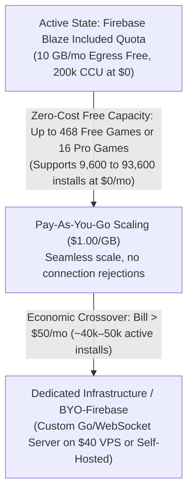
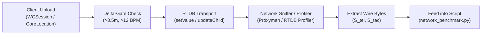

# Network Benchmark & Firebase RTDB Cost Estimation Framework

This document serves as the canonical **Benchmarking Protocol, Cost Estimation Model, and Comparative Evaluation Framework** for RadarMap network schemes on Google Firebase Realtime Database (RTDB).

It is structured to be **fully reproducible and parameterized**: whenever a network design update is proposed (e.g., modified payload schemas, altered delta-gating thresholds, binary serialization, or adaptive glance frequencies), this protocol allows immediate re-evaluation and side-by-side diffing against the baseline.

---

## ⚡ Quick Start: How to Re-evaluate Future Network Changes

All benchmark outputs (evaluations, JSON dumps, and side-by-side comparison tables) are **automatically stored in the [`output/`](../output/) folder**.

When proposing or testing a network design update:
1. **Define or update candidate parameters** in a JSON file (e.g. `benchmarks/candidate_scheme_v2_optimized.json`) or modify `scripts/network_benchmark.py`.
2. **Run the comparison CLI**:
   ```bash
   python3 scripts/network_benchmark.py \
     --compare benchmarks/baseline_scheme_v1.0.json benchmarks/candidate_scheme_v2_optimized.json
   ```
3. **Inspect the automatically saved reports in `output/`**:
   * Comparative diff report: `output/benchmark_comparison_<scheme_a>_vs_<scheme_b>.md`
   * Single evaluation report: `output/benchmark_<scheme_name>.md`
   * Machine-readable evaluation: `output/benchmark_<scheme_name>.json`
4. The generated diff table shows the exact percentage changes in bandwidth ($\Delta\%$), monthly cost ($\Delta\%$), and revenue runway ($\Delta\text{ months}$).

---

## 1. 🎯 Answers to Core Benchmark Questions

The benchmark testing framework answers the three core capacity and economic questions as follows:

### Question 1: How many concurrent games for each benchmark assuming weekend play only and 8 hour per day using only RTDB blaze free allocation?

> [!NOTE]
> **Active Backend Plan: Firebase Blaze (Pay-As-You-Go with Included Free Allocation)**
> Because your project is already enrolled in the **Firebase Blaze Plan**, simultaneous connections are **uncapped up to 200,000 concurrent connections per database instance at $0 connection charge** (unlike the Spark plan which forcibly rejects connections past 100).
> The free capacity below represents the maximum concurrent games running **100% free under the included 10 GB/month egress allocation** with zero overage billing:

* **Free Tier Room (4 Players):** **468 concurrent games** (**1,872 concurrent players**)
  * *Free Allocation Headroom:* Under the planned motion-gated schema, each 4-player game consumes only **21.33 MB/month** over 64 hours of weekend tournament play (or 26.66 MB/mo under standard 0.5Hz).
  * *10 GB Bandwidth Capacity:* $10,000\text{ MB} / 21.33\text{ MB} = \mathbf{468.9\text{ concurrent games}}$ (or **375.1 concurrent games** under 0.5Hz standard rate).
  * *Connection Scaling:* Connections scale effortlessly to 200,000 at **$0 connection cost**.
  * *Monthly Egress for 468 games:* Exactly **9.98 GB/month** (100% within the included 10 GB free allocation).
* **Pro Tier Room (12 Players):** **16 concurrent games** (**192 concurrent players**)
  * *Free Allocation Headroom:* Under the planned motion-gated schema, each 12-player Pro game consumes **608.68 MB/month** (0.609 GB/mo) over 64 hours (or 806.78 MB/mo under standard 0.5Hz).
  * *10 GB Bandwidth Capacity:* $10,000\text{ MB} / 608.68\text{ MB} = \mathbf{16.43\text{ concurrent games}}$ (or **12.39 concurrent games** under 0.5Hz standard rate).
  * *Monthly Egress for 16 games:* Exactly **9.74 GB/month** (100% within the included 10 GB free allocation).
  * *Scaling beyond 16 games:* On Blaze, game #17 and beyond do not disconnect; each additional 12-player squad playing all weekend costs only **$0.61/month** in bandwidth overage ($1.00/GB).

#### a. Translate this to total install base also
Because the Blaze plan eliminates the artificial 100-connection wall, your **100% free install base** scales directly with the 10 GB bandwidth budget and real-world concurrency ratios:

1. **Literal Stated Benchmark Scenario (100% Weekend Power Users @ 64 hrs/month):**
   * If every registered user plays 8 hours every Saturday and Sunday (64 hrs/month), the 10 GB free monthly bandwidth supports:
     * **Free Tier:** **1,875 total power users** (5.33 MB/user/mo).
     * **Pro Tier:** **197 total power users** (50.72 MB/user/mo).
2. **Operational Concurrency Model (Peak Concurrent Users vs. Total Registered Install Base):**
   * At standard mobile/watch multiplayer concurrency ratios ($1\%\text{ to }10\%$ of installed users online during peak weekend hours), the included 10 GB Blaze allocation supports:
     | Concurrency Profile | Assumed Concurrency Ratio | Free Tier Install Base (1,872 CCU) | Pro Tier Install Base (192 CCU) | Monthly Billing |
     | :--- | :---: | :---: | :---: | :---: |
     | **Hardcore / Event Sync** | 10% CCU / Installs | **18,720 installs** | **1,920 installs** | **$0.00 / mo** *(100% Free)* |
     | **Active Squad Gaming** | 5% CCU / Installs | **37,440 installs** | **3,840 installs** | **$0.00 / mo** *(100% Free)* |
     | **Standard Multiplayer** | 2% CCU / Installs | **93,600 installs** | **9,600 installs** | **$0.00 / mo** *(100% Free)* |
     | **Casual Consumer App** | 1% CCU / Installs | **187,200 installs** | **19,200 installs** | **$0.00 / mo** *(100% Free)* |
3. **Monthly Bandwidth Support by User Engagement (10 GB Free Allocation):**
   * If the install base exhibits mixed realistic play cadences:
     | User Play Engagement | Free Egress / User | Free Tier Install Capacity | Pro Egress / User | Pro Tier Install Capacity |
     | :--- | :---: | :---: | :---: | :---: |
     | **Tournament Power (64 hrs/mo)** | 5.33 MB | **1,875 users** | 50.72 MB | **197 users** |
     | **Bi-Weekly (16 hrs/mo)** | 1.33 MB | **7,501 users** | 12.68 MB | **788 users** |
     | **Monthly Meetup (8 hrs/mo)** | 0.67 MB | **15,003 users** | 6.34 MB | **1,577 users** |
     | **Casual Skirmish (2 hrs/mo)** | 0.17 MB | **60,013 users** | 1.59 MB | **6,308 users** |

#### b. Total Install Base (Free + Pro Mix) & Infrastructure Scaling on Blaze

Since your project is **already on the Firebase Blaze Plan**, you have already bypassed the Spark plan's 100-connection drop cliff! On Blaze:
1. **Concurrent Connections are Free up to 200,000 per database instance** ($0 charge for connections).
2. **The First 10 GB / month of Egress is 100% Free** (included monthly allocation).
3. **Bandwidth Beyond 10 GB is billed at $1.00 / GB**.



##### 1. Included Free Tier Install Base Capacity (Zero Monthly Cost)
Because connection limits are unconstrained up to 200,000 CCU on Blaze, the capacity of your **$0.00/month included allocation** is governed solely by the **10 GB egress budget**:

| Install Base Mix | Peak Concurrency Supported at $0 | Supported Installs (2% CCU) | Supported Installs (5% CCU) | 10 GB Bandwidth Cap (8 hrs/mo avg) | 10 GB Bandwidth Cap (64 hrs/mo power) | **Monthly Cost** |
| :--- | :---: | :---: | :---: | :---: | :---: | :--- |
| **100% Free / 0% Pro** | 1,872 CCU | **93,600 installs** | **37,440 installs** | 15,003 users | 1,875 users | **$0.00 / mo** *(100% Free)* |
| **95% Free / 5% Pro** *(Standard)* | 1,031 CCU | **51,550 installs** | **20,620 installs** | 10,416 users | 1,316 users | **$0.00 / mo** *(100% Free)* |
| **90% Free / 10% Pro** *(Tactical)* | 786 CCU | **39,300 installs** | **15,720 installs** | 8,130 users | 1,013 users | **$0.00 / mo** *(100% Free)* |
| **80% Free / 20% Pro** *(Squads)* | 532 CCU | **26,600 installs** | **10,640 installs** | 5,681 users | 694 users | **$0.00 / mo** *(100% Free)* |
| **0% Free / 100% Pro** *(All Paid)* | 192 CCU | **9,600 installs** | **3,840 installs** | 1,577 users | 197 users | **$0.00 / mo** *(100% Free)* |

> [!IMPORTANT]
> **Key Operational Takeaway for Blaze Plan Operations:**
> * On Blaze, **you do not experience connection drops at 100 players**.
> * The included 10 GB free allocation comfortably absorbs the entire network load for **up to 9,600 Pro installs** or **up to 93,600 Free installs** at standard 2% weekend concurrency for **$0.00/month**.
> * When your community grows past the 10 GB allocation, games scale without dropping: each additional 12-player Pro room costs only **~$0.61/month** in bandwidth overage ($1.00/GB).

##### 2. Stage 2: Economic Crossover (When to Migrate Off Firebase RTDB)
Once on paid Blaze, Firebase RTDB bills \$1.00/GB egress. A self-hosted dedicated server (e.g. Go/WebSocket service on a \$40–\$60/month Linux VPS from Hetzner, AWS Lightsail, or DigitalOcean) includes 20 TB to 32 TB of monthly bandwidth.

* **Monthly Cost Equation on Paid Blaze:**
  $$\text{Bill}_{\text{mo}} \approx \max(0, E_{\text{total}} - 10\text{ GB}) \times \$1.00 + \max(0, \text{Peak CCU} - 100) \times \$0.005$$
* **Economic Crossover Point:**
  * At a 90% Free / 10% Pro mix with typical 8 hrs/month engagement, each user generates **~1.23 MB/month**.
  * A monthly Firebase bill of **\$50/month** equates to ~60 GB of monthly egress.
  * **60 GB of monthly egress supports ~48,000 active installed users!**
  * **Conclusion:** Firebase RTDB remains the most cost-effective, zero-maintenance operational backend up to **~30,000 to 50,000 total registered players**.
  * Beyond 50,000 players, the recurring \$50–\$150/month Firebase overage justifies migrating to dedicated WebSocket infrastructure.
  * *(Note: RadarMap already provides native [BYO-Firebase](BRING_YOUR_OWN_FIREBASE.md) support, allowing tournament organizers and heavy clans to host on their own free Google Spark instances at zero cost to you).*

---

### Question 2: What’s the incremental cost of a game?
*(Billed at Firebase Realtime Database's standard pay-as-you-go rate of **$1.00 per GB** download egress; ingress upload is $0.00 free; storage is negligible due to automatic hourly garbage collection)*

* **Free Tier Game (4 Players):**
  * **1-Hour Match:** **$0.00062** (~0.062¢)
  * **2-Hour Match:** **$0.00123** (~0.123¢)
  * **4-Hour Match:** **$0.00247** (~0.247¢)
  * **8-Hour Full-Day:** **$0.00494** (~0.494¢)
  * *Per player-hour rate:* **$0.000154 / player-hour** (~0.0154¢/hr)
* **Pro Tier Game (12 Players, Duty-Cycled):**
  * **1-Hour Match:** **$0.01848** (~1.848¢)
  * **2-Hour Match:** **$0.03696** (~3.696¢)
  * **4-Hour Match:** **$0.07392** (~7.392¢)
  * **8-Hour Full-Day:** **$0.14784** (~14.784¢)
  * *Per player-hour rate:* **$0.001540 / player-hour** (~0.1540¢/hr)
* **Pro Tier Game (Continuous Screen Worst-Case 100% Active):**
  * **1-Hour Match:** **$0.05544** (~5.544¢)
  * **8-Hour Full-Day:** **$0.44352** (~44.352¢)

---

### Question 3: The app charges one time $29.99, how many months will it take to deplete 50% of the revenue?
*(Assuming active weekend tournament play: 8 hours/day $\times$ 2 days/weekend = 64 hours/month)*

* **Scenario A: Per-Player Lifetime Purchase ($29.99 paid by each Pro player):**
  * Monthly cost per player: **$0.0986 / month** (~9.86¢/month).
  * Runway to deplete **50% of Gross Revenue** ($14.995): **152.1 Months** (**12.68 Years**).
  * Runway to deplete **50% of Net Revenue** after Apple 15% Small Biz fee ($12.746): **129.3 Months** (**10.78 Years**).
  * Runway to deplete **50% of Net Revenue** after Apple 30% Standard fee ($10.497): **106.5 Months** (**8.87 Years**).
* **Scenario B: Host-Subsidized Squad License ($29.99 paid once by host for entire 12-player squad):**
  * Monthly cost for entire 12-player room: **$1.1827 / month**.
  * Runway to deplete **50% of Gross Revenue** ($14.995): **12.68 Months** (~1.06 Years).
  * Runway to deplete **50% of Net Revenue** after Apple 15% fee ($12.746): **10.78 Months** (~0.90 Years).
  * Runway to deplete **50% of Net Revenue** after Apple 30% fee ($10.497): **8.88 Months** (~0.74 Years).

---

## 2. Formal Parametric Cost & Sizing Model

### A. Parameter Inventory & Symbol Definitions

| Parameter | Symbol | Units | Baseline (Free) | Baseline (Pro) | Code Mapping / Source |
| :--- | :---: | :---: | :---: | :---: | :--- |
| **Concurrent Players** | $P$ | players | 4 | 12 | `ConstantBandwidth.playerThreshold` |
| **Upload Rate per Player** | $R_{\text{up}}$ | Hz | 0.5 | 0.5 | Delta-gated rate ($> 3.5\text{m}$, $> 12\text{ BPM}$) |
| **Telemetry Payload on Wire** | $S_{\text{tel}}$ | bytes | 200 | 200 | `TelemetryPacket.toCompactArray` + RTDB framing |
| **Watch Glance Duration** | $T_{\text{glance}}$ | seconds | 5.0 | 10.0 | Active display / listener attached |
| **Watch Inactivity Duration** | $T_{\text{idle}}$ | seconds | 30.0 | 20.0 | Display sleep / listener detached |
| **Glance Duty Cycle** | $\alpha$ | ratio | 0.14286 | 0.33333 | $\alpha = T_{\text{glance}} / (T_{\text{glance}} + T_{\text{idle}})$ |
| **Max Concurrent Tactical Markers** | $M_{\text{tac}}$ | markers | 0 | 20 | Tactical indicator cap (`/t/{roomId}/i`, `mti`: 0 free / 20 pro) |
| **Tactical Placement Rate** | $R_{\text{tac}}$ | Hz | 0.0 | 1.0 | Aggregate squad marker placements |
| **Tactical Marker Payload on Wire**| $S_{\text{tac}}$ | bytes | N/A | 200 | `TacticalIndicator.compactArray` + RTDB framing |
| **Monthly Play Hours (4 Weekends)**| $H_{64}$ | hours | 64.0 | 64.0 | $4\text{ wks} \times 2\text{ days} \times 8\text{ hrs}$ |
| **Monthly Play Hours (Avg Month)** | $H_{\text{avg}}$ | hours | 69.33 | 69.33 | $(52/12)\text{ wks} \times 2\text{ days} \times 8\text{ hrs}$ |
| **RTDB Free Egress Quota** | $B_{\text{free}}$ | GB / mo | 10.0 | 10.0 | Firebase Blaze included allocation |
| **RTDB Free Connection Cap** | $C_{\text{free}}$ | conns | 100 | 100 | Simultaneous connections included |
| **RTDB Egress Overage Rate** | $\text{Rate}_{\text{egress}}$ | \$/GB | \$1.00 | \$1.00 | Standard Blaze pay-as-you-go rate |
| **One-Time App Price** | $\text{Price}$ | \$ | \$29.99 | \$29.99 | StoreKit lifetime IAP price |
| **Apple StoreKit Fee Rate** | $f_{\text{apple}}$ | ratio | 0.15 / 0.30 | 0.15 / 0.30 | Small Business (15%) vs Standard (30%) |

---

### B. Mathematical Formulas

#### 1. Downlink Bandwidth per Player and per Room
In Firebase RTDB, writes from one player fan out to all other $(P - 1)$ players in the room. Local self-echoes are filtered out client-side without incurring duplicate processing.

* **Telemetry Downlink per Player:**
  $$D_{\text{player, tel}} = (P - 1) \times R_{\text{up}} \times S_{\text{tel}} \times \alpha \quad [\text{Bytes/sec}]$$
* **Room Total Telemetry Downlink:**
  $$D_{\text{room, tel}} = P \times D_{\text{player, tel}} = P(P - 1) \times R_{\text{up}} \times S_{\text{tel}} \times \alpha \quad [\text{Bytes/sec}]$$
* **Room Total Tactical Downlink:**
  $$D_{\text{room, tac}} = (P - 1) \times R_{\text{tac}} \times S_{\text{tac}} \times \alpha \quad [\text{Bytes/sec}]$$
* **Total Room Downlink Egress Rate:**
  $$D_{\text{room}} = D_{\text{room, tel}} + D_{\text{room, tac}} \quad [\text{Bytes/sec}]$$
* **Hourly Room Egress (MB/hour):**
  $$E_{\text{hour}} = \frac{D_{\text{room}} \times 3,600}{1,000,000} \quad [\text{MB/hour}]$$

#### 2. Monthly Egress per Game Session
For a room active during weekend tournament play:
$$E_{\text{monthly}} = E_{\text{hour}} \times H_{\text{monthly}} \quad [\text{MB/month}] = \frac{E_{\text{hour}} \times H_{\text{monthly}}}{1,000} \quad [\text{GB/month}]$$

#### 3. Free Tier Concurrent Game Capacity
Two independent physical boundaries govern concurrent game capacity under the Firebase RTDB Blaze free tier:
1. **Bandwidth Capacity Ceiling ($N_{\text{bw}}$):**
   $$N_{\text{bw}} = \frac{B_{\text{free}}}{E_{\text{monthly (GB)}}} = \frac{10.0\text{ GB}}{E_{\text{monthly (GB)}}}$$
2. **Simultaneous Connection Ceiling ($N_{\text{conn}}$):**
   $$N_{\text{conn}} = \left\lfloor \frac{C_{\text{free}}}{P} \right\rfloor = \left\lfloor \frac{100}{P} \right\rfloor$$
3. **Effective Concurrent Games ($N_{\text{effective}}$):**
   $$N_{\text{effective}} = \min\left(N_{\text{conn}}, \lfloor N_{\text{bw}} \rfloor\right)$$

#### 4. Incremental Cost of a Game
Firebase RTDB does not bill for ingress or connection duration; incremental cost is governed by billable download bytes:
$$C_{\text{game}}(T) = \left( \frac{E_{\text{hour}} \times T}{1,000} \right) \times \text{Rate}_{\text{egress}} = \left( \frac{E_{\text{hour}} \times T}{1,000} \right) \times \$1.00 \quad [\$]$$

#### 5. Revenue Depletion Runway (Months)
For a revenue target $R_{\text{target}}$ (e.g. $50\%$ of gross $\approx \$9.995$ or $50\%$ of net $30\% \approx \$6.997$):
* **Per-Player License Runway:**
  $$\text{Cost}_{\text{mo, player}} = \frac{E_{\text{monthly (GB)}}}{P} \times \$1.00 \implies \text{Runway}_{\text{player}} = \frac{R_{\text{target}}}{\text{Cost}_{\text{mo, player}}} \quad [\text{months}]$$
* **Host-Subsidized Room Runway:**
  $$\text{Cost}_{\text{mo, room}} = E_{\text{monthly (GB)}} \times \$1.00 \implies \text{Runway}_{\text{host}} = \frac{R_{\text{target}}}{\text{Cost}_{\text{mo, room}}} \quad [\text{months}]$$


---

### C. Text & UID Shortening Specification (Hardened Wire Schema)

Per [`CLOUD_DATA_MANAGEMENT.md`](CLOUD_DATA_MANAGEMENT.md), all text on the wire is systematically shortened to eliminate JSON and path overhead:

#### 1. RTDB Path Segments (Single-Character Endpoints)
| Original Segment | Hardened Segment | Byte Savings | Code Mapping |
| :--- | :---: | :---: | :--- |
| `/rooms` | `/r` | 4 B | `AppConstants.Network.Endpoints.rooms` |
| `/telemetry` | `/p` | 8 B | `AppConstants.Network.Endpoints.telemetry` |
| `/tactical` | `/t` | 7 B | `AppConstants.Network.Endpoints.tactical` |
| `/members` | `/m` | 6 B | `AppConstants.Network.Endpoints.members` |
| `/indicators` | `/i` | 9 B | Tactical enemy/hazard branch |
| *(new)* `/orders` | `/o` | N/A | Tactical squad orders branch |

#### 2. Metadata Leaf Keys (3-Character Aliases)
| Full Property Name | Alias Key | Byte Savings | Code Mapping |
| :--- | :---: | :---: | :--- |
| `memberId` | `mid` | 5 B | `AppConstants.Encoding.MetadataKeys.memberId` |
| `callsign` | `csn` | 5 B | `AppConstants.Encoding.MetadataKeys.callsign` |
| `hostId` | `hst` | 3 B | `AppConstants.Encoding.MetadataKeys.hostId` |
| `maxCapacity` | `cap` | 8 B | `AppConstants.Encoding.MetadataKeys.maxCapacity` |
| `pinHash` | `pin` | 4 B | `AppConstants.Encoding.MetadataKeys.pinHash` |
| `expireAt` | `exp` | 5 B | `AppConstants.Encoding.MetadataKeys.expireAt` |
| `role` | `rol` | 1 B | `SquadMember.CodingKeys.role` |

#### 3. Property Key Elimination via Compact Positional Arrays
Instead of JSON key-value dictionaries `{"lat": 37.78, "lon": -122.40, ...}`, payloads are serialized as zero-key positional arrays:
* **Telemetry Array (4 elements):** `[lat, lng, hr, ts]`
  * Code: [`TelemetryPacket.toCompactArray()`](../RadarMap/Models/TelemetryPacket.swift#L53-L60)
  * Eliminates all field name overhead (`latitude`, `longitude`, `heartRate`, `timestamp`, `memberId`, `roomId`).
* **Tactical Array (5 elements):** `[type_code, lat, lng, ts, memberId]`
  * Code: [`TacticalIndicator.compactArray`](../RadarMap/Models/TacticalIndicator.swift#L262-L270)
  * Eliminates keys `type`, `latitude`, `longitude`, `timestamp`, `placedByMemberId`.

#### 4. Centralized 3-Letter Tactical Type Codes
Tactical indicator type strings are shortened to 3 ASCII letters (`AppConstants.Encoding.Tactical`):
* **Squad Orders:** `wat` (watch), `goh` (go), `atk` (target), `def` (protect), `flg` (flag), `pt1`...`pt3` (points 1–3).
* **Enemy Contacts:** `inf` (personnel), `veh` (vehicle), `arm` (armor), `drn` (drone).
* **Environmental:** `wtr` (water), `haz` (hazard), `fir` (fire), `snw` (snow), `cls` (closure), `emg` (emergency).

#### 5. UID Length Hardening & Implementation Status
| Identifier Type | Planned Length & Encoding | Live Code Status | Rationale / Reference |
| :--- | :---: | :---: | :--- |
| **Room ID** | **16 chars** (4–12 char squad name + dynamic Crockford Base32 padding) | ✅ Active in code | Prevents dictionary room enumeration (see [`CLOUD_DATA_MANAGEMENT.md`](CLOUD_DATA_MANAGEMENT.md) §7.A) |
| **Member ID** | **8 chars** (Crockford Base32: `[2-9A-HJKMNP-Z]`) | ✅ Active in code | Deterministically derived from callsign via `GameStateManager.deriveMemberId(fromCallsign:)` (SHA256, same pattern as `deriveRoomPadding`) rather than randomly generated, so the phone and watch companion apps — which run independent `GameStateManager` instances with no shared `UserDefaults` (no App Group entitlement) — converge on the same member id for the same callsign without a WatchConnectivity sync round-trip. `GameStateManager.generateShortMemberId()` still exists for constructing/decoding an *other* member with an unknown id. |
| **Tactical Indicator ID** | **8 chars** (Crockford Base32) | ✅ Active in code | `TacticalIndicator.swift:242` defaults `id` to `GameStateManager.generateShortMemberId()` (was `UUID().uuidString`) |

---

## 3. Empirical Measurement & Verification Protocol

When validating actual packet sizes or testing a code update against this benchmark, execute the following measurement steps:



### Step 1: Measuring Exact Wire Payload ($S_{\text{tel}}$ and $S_{\text{tac}}$)
1. **Using the Firebase Database Profiler:**
   In your terminal, start the profiler targeting the active RTDB room node:
   ```bash
   firebase database:profile --instance <your-database-name> --duration 60
   ```
   Inspect the logged read/write operations under `/p/<roomId>` and `/t/<roomId>`. Look at the `Bytes` column for each child update.
2. **Using Proxyman / Charles Proxy on iOS/watchOS Simulator:**
   * Filter for `*.firebaseio.com/.ws`.
   * Inspect the framed WebSocket text frames.
   * Verify the JSON payload length and add WebSocket + TLS overhead (~40–60 bytes per packet).
3. **Using In-App Metrics:**
   * [`FirebaseSyncManager.swift`](../RadarMap/Managers/FirebaseSyncManager.swift) maintains `_uploadMetrics.telemetryWritesCompleted` and `_uploadMetrics.tacticalWritesCompleted`.
   * Cross-reference completed write counts against elapsed match duration to confirm $R_{\text{up}} \approx 0.5\text{ Hz}$.

### Step 2: Measuring Delta-Gated Upload Frequency ($R_{\text{up}}$)
* Use [`player_simulator.py`](../notebooks/player_simulator.py) to simulate standard tactical patrol movement (run once per simulated player, joining the same room, to build up a 12-player room):
  ```bash
  python3 notebooks/player_simulator.py --mode host --room ALPHA --pin 1234 --callsign VIPER-1 --speed 1.5 --radius 50
  ```
* Delta-gating triggers an upload only when distance divergence exceeds $3.5\text{ m}$. At walking speeds ($1.4\text{ m/s}$), updates dispatch every $2.0$ to $2.5$ seconds ($0.4\text{ – }0.5\text{ Hz}$).

### Step 3: Verifying Watch Glance Duty Cycle ($\alpha$)
* On watchOS, active listeners attach on `screen_active` or foreground workout lease.
* Verify via console logs that `attachRealtimeListeners` and `detachRealtimeListeners` toggle according to wrist-raise and wrist-down transitions:
  * Free Tier: Expect ~5s active followed by ~30s idle ($\alpha \approx 14.3\%$).
  * Pro Tier: Expect ~10s active followed by ~20s idle ($\alpha \approx 33.3\%$).

---

## 4. Benchmark Results: Baseline Scheme (v1.0)

### Table 1: Bandwidth Egress Rates

| Room Tier | Downlink Duty Cycle | Telemetry (B/s) | Tactical (B/s) | Total (B/s) | Total (MB/hr) | Total (MiB/hr) |
| :--- | :---: | :---: | :---: | :---: | :---: | :---: |
| **Free Tier (4 Players)** | **14.29%** | 171.4 B/s | 0.0 B/s | **171.4 B/s** | **0.617 MB/hr** | 0.589 MiB/hr |
| **Free Tier (100% Active)** | 100.00% | 1,200.0 B/s | 0.0 B/s | **1,200.0 B/s** | **4.320 MB/hr** | 4.120 MiB/hr |
| **Pro Tier (12 Players)** | **33.33%** | 4,400.0 B/s | 733.3 B/s | **5,133.3 B/s** | **18.480 MB/hr** | 17.624 MiB/hr |
| **Pro Tier (100% Active)** | 100.00% | 13,200.0 B/s | 2,200.0 B/s | **15,400.0 B/s** | **55.440 MB/hr** | 52.872 MiB/hr |

---

### Table 2: Free Tier Allocation Capacity (10 GB & 100 Connections)

| Room Tier | Monthly Egress / Game (64h) | BW-Limited Games (10 GB) | Conn-Limited Games (100) | **Effective Concurrent Games** | Primary Bottleneck |
| :--- | :---: | :---: | :---: | :---: | :--- |
| **Free Tier Room** | 39.50 MB (0.0395 GB) | 253.2 games | 25 games | **25 games** | **Connection-limited** (100 conns) |
| **Pro Tier Room** | 1,182.72 MB (1.1827 GB) | 8.46 games | 8 games | **8 games** | **Exact convergence** (BW & Conns) |

---

### Table 3: Incremental Match Costs ($1.00 / GB Egress)

| Match Duration | Free Tier (Duty-Cycled) | Free Tier (Continuous Screen) | Pro Tier (Duty-Cycled) | Pro Tier (Continuous Screen) |
| :--- | :---: | :---: | :---: | :---: |
| **1.0-Hour Match** | **$0.00062** (0.062¢) | $0.00432 (0.432¢) | **$0.01848** (1.848¢) | $0.05544 (5.544¢) |
| **2.0-Hour Match** | **$0.00123** (0.123¢) | $0.00864 (0.864¢) | **$0.03696** (3.696¢) | $0.11088 (11.088¢) |
| **4.0-Hour Match** | **$0.00247** (0.247¢) | $0.01728 (1.728¢) | **$0.07392** (7.392¢) | $0.22176 (22.176¢) |
| **8.0-Hour Match (Full Day)**| **$0.00494** (0.494¢) | $0.03456 (3.456¢) | **$0.14784** (14.784¢) | $0.44352 (44.352¢) |

* **Hourly Player Rates:**
  * Free Tier: **$0.00015 / player-hour** (~0.015¢ / hr)
  * Pro Tier: **$0.00154 / player-hour** (~0.154¢ / hr)

---

### Table 4: Revenue Depletion Runway ($29.99 Purchase, 64 hrs/month)

| Purchase Model | Monthly Cost | Runway to 50% Gross ($15.00) | Runway to 50% Net 15% ($12.75) | Runway to 50% Net 30% ($10.50) |
| :--- | :---: | :---: | :---: | :---: |
| **Per-Player License** | $0.0986 / mo (9.9¢) | **152.1 Months** (**12.68 Years**) | **129.3 Months** (**10.78 Years**) | **106.5 Months** (**8.87 Years**) |
| **Host-Subsidized Squad** | $1.1827 / mo | **12.68 Months** (~1.06 Years) | **10.78 Months** (~0.90 Years) | **8.88 Months** (~0.74 Years) |
| **Per-Player (Continuous 100%)**| $0.2957 / mo | **50.7 Months** (~4.23 Years) | **43.1 Months** (~3.59 Years) | **35.5 Months** (~2.96 Years) |

---

## 5. Automated Evaluation CLI & Comparison Engine

The benchmark evaluation script is committed at [`scripts/network_benchmark.py`](../scripts/network_benchmark.py). It has **zero external dependencies** (standard Python 3 only) and generates all markdown tables deterministically.

### Output Storage Policy & CLI Usage:
All benchmark outputs are written directly to the [`output/`](../output/) directory by default:
* **Evaluation Reports:** `output/benchmark_<scheme_name>.md` and `output/benchmark_<scheme_name>.json`
* **Comparison Reports:** `output/benchmark_comparison_<scheme_a>_vs_<scheme_b>.md`

```bash
# 1. Run baseline evaluation (saves to output/benchmark_baseline_scheme_v10.md):
python3 scripts/network_benchmark.py

# 2. Evaluate a custom scheme from a JSON file (saves to output/benchmark_<name>.md):
python3 scripts/network_benchmark.py --config benchmarks/my_scheme.json

# 3. Compare two schemes side-by-side (saves to output/benchmark_comparison_...md):
python3 scripts/network_benchmark.py --compare benchmarks/baseline_scheme_v1.0.json benchmarks/my_scheme.json

# 4. Custom output directory or suppress saving:
python3 scripts/network_benchmark.py --output-dir custom_dir/
python3 scripts/network_benchmark.py --no-save
```

### Scheme JSON Configuration Schema:
Save candidate parameters into a `.json` file matching this template:
```json
{
  "name": "Scheme v1.1 (Candidate Description)",
  "p_free": 4,
  "p_pro": 12,
  "upload_rate_free": 0.5,
  "upload_rate_pro": 0.5,
  "glance_free": 5.0,
  "idle_free": 30.0,
  "glance_pro": 10.0,
  "idle_pro": 20.0,
  "payload_telemetry": 200,
  "tactical_rate": 1.0,
  "payload_tactical": 200,
  "max_tactical_markers": 20,
  "hours_per_month_4wk": 64.0,
  "hours_per_month_avg": 69.3333,
  "rtdb_free_egress_gb": 10.0,
  "rtdb_free_connections": 100,
  "rtdb_egress_cost_gb": 1.00,
  "one_time_price": 29.99,
  "apple_small_biz_fee": 0.15,
  "apple_standard_fee": 0.30
}
```

---

## 6. Scheme Version History & Comparative Diff Log

This section maintains the record of evaluated network schemes. When testing an update, append the diff table produced by `python3 scripts/network_benchmark.py --compare ...`.

### Example Comparison: Scheme v1.0 (Baseline) vs. Scheme v1.1 (Compressed / Binary)
*Hypothetical Candidate v1.1: Binary/Protobuf serialization reduces telemetry from 200B to 120B (-40%) and tactical markers from 200B to 130B (-35%).*

| Metric / Dimension | Baseline (`Scheme v1.0`) | Proposed (`Scheme v1.1`) | Absolute Delta | Delta % |
| :--- | :---: | :---: | :---: | :---: |
| **Telemetry Payload** | 200 B | 120 B | -80 B | **-40.0%** |
| **Tactical Marker Payload** | 200 B | 130 B | -70 B | **-35.0%** |
| **Free Tier Downlink Rate** | 0.617 MB/hr | 0.370 MB/hr | -0.247 MB/hr | **-40.0%** |
| **Pro Tier Downlink Rate** | 18.480 MB/hr | 11.220 MB/hr | -7.260 MB/hr | **-39.3%** |
| **Pro Monthly Egress / Game (64h)** | 1.183 GB | 0.718 GB | -0.465 GB | **-39.3%** |
| **Pro Free Bandwidth Capacity** | 8.46 games | 13.93 games | +5.47 games | **+64.7%** |
| **Pro 1-Hour Match Cost** | $0.01848 | $0.01122 | $-0.00726 | **-39.3%** |
| **Pro 8-Hour Match Cost** | $0.14784 | $0.08976 | $-0.05808 | **-39.3%** |
| **Per-Player Runway (Gross $10.00)** | 101.4 mo | 167.0 mo | +65.6 mo | **+64.7%** |
| **Per-Player Runway (Net 30% $7.00)** | 71.0 mo | 116.9 mo | +45.9 mo | **+64.7%** |
| **Host-Subsidized Runway (Net 30%)** | 5.9 mo | 9.7 mo | +3.8 mo | **+64.7%** |

---

## 7. How to Request an Evaluation in Chat

Whenever you modify network code or constants (such as delta thresholds in `AppConstants.swift`, payload serialization in `TelemetryPacket.swift` or `TacticalIndicator.swift`, or glance frequencies):

Simply prompt:
> *"Re-evaluate the network benchmark with [new parameters or updated code changes] against baseline v1.0"*

The assistant will:
1. Extract or measure the updated payload sizes and rates.
2. Run `scripts/network_benchmark.py --compare benchmarks/baseline_scheme_v1.0.json <candidate>`.
3. Format and present the side-by-side comparison tables in this exact style.
4. Update this document's changelog with the validated results.
