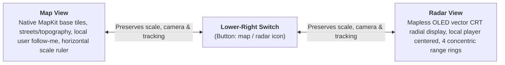
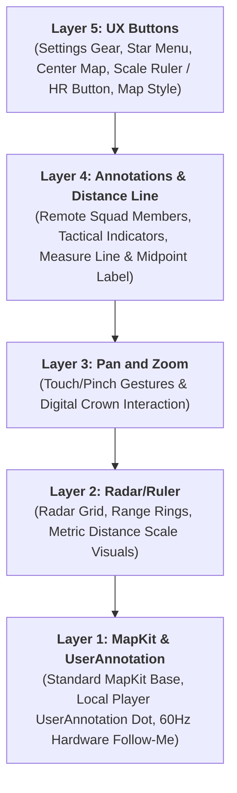

# Tactical UI & Radar Specification (Map, Radar & Visual Systems)

This document is the authoritative design and implementation specification for the user interface, interaction semantics, scale models, and platform adapters of **Radar Map** (watchOS & iOS).

---

## 📋 Table of Contents

* [Key Constants & Configuration Reference](#-key-constants--configuration-reference)
1. [Product Model & Two-Presentation Architecture](#1-product-model--two-presentation-architecture)
2. [Non-Negotiable Motion Rules (60Hz Native Tracking)](#2-non-negotiable-motion-rules-60hz-native-tracking)
3. [Canonical Scale Semantics & The Discrete Ladder](#3-canonical-scale-semantics--the-discrete-ladder)
4. [Tactical Radar View Specification](#4-tactical-radar-view-specification)
5. [Platform-Specific Map Adapters (iOS vs. watchOS)](#5-platform-specific-map-adapters-ios-vs-watchos)
6. [HUD Controls, Gestures & Centering Semantics](#6-hud-controls-gestures--centering-semantics)
7. [Visual Styling, Themes & Layers Hierarchy](#7-visual-styling-themes--layers-hierarchy)
8. [Code Audit & Verification Checklist](#8-code-audit--verification-checklist)

---

## ⚡ Key Constants & Configuration Reference

The following centralized constants from [`AppConstants.swift`](../RadarMap/AppConstants.swift) and [`TacticalScalePolicy.swift`](../RadarMap/Models/TacticalScalePolicy.swift) govern all tactical presentation, geometry, timing, and HUD calculations:

| Section & Domain | Constant / Property | Value / Definition | Purpose & Behavioral Impact |
| :--- | :--- | :--- | :--- |
| **§1 Presentations** | `TacticalPresentation` | `.map` vs `.radar` | Top-level visual layout switch; strictly preserves camera, scale, and tracking |
| **§2 Motion & Tracking** | Hardware Compositor Rate | `60Hz` (watchOS) / `120Hz` (iOS) | Native MapKit `showsUserLocation` / `UserAnnotation` follow-me refresh rate |
| **§2 Motion & Tracking** | `centerThresholdMeters` | `10.0m` (`AppConstants.Location`) | Deadband threshold before map transitions from local follow to free-roam pan |
| **§3 Tactical Scales** | `defaultScale` | `50.0m` (`TacticalScalePolicy`) | Baseline minor scale on initial room entry or cold boot |
| **§3 Tactical Scales** | `standardAllowedScales` | `[1, 2.5, 5, 10, 25, 50, 100, 250, 500, 1000, 2500]` m | Canonical discrete logarithmic decade scale ladder |
| **§3 Tactical Scales** | Scale Range Bounds | `1.0m` min / `2,500.0m` max | Clamping boundaries for Digital Crown and Radar-view zoom. Does **not** clamp iPhone/iPad Standard map pinch-to-zoom, which is free native MapKit zoom (§5.D.3) |
| **§4 Radar Geometry** | `rangeRingRatios` | `[0.25, 0.50, 0.75, 1.0]` (`RadarScale`) | Radial multipliers for 4 concentric rings ($S, 2S, 3S, 4S$) |
| **§4 Radar Geometry** | `radarRadiusRatio` | `0.44` (`RadarScale`) | Outer ring radius as fraction of minimum screen dimension |
| **§4 Radar Geometry** | Outer Ring Gating | $d > 4 \times S$ | Strict out-of-range cutoff; entities beyond $4S$ are dropped |
| **§4 Radar Geometry** | `radarUIHz` | `20.0 Hz` (50ms interval) | Vector CRT sweep and target rendering refresh frequency |
| **§5 Map Adapters** | Camera FOV Half-Angle | `15.0°` (`30.0°` total FOV) | Tangent factor: $\text{altitude} = \frac{\text{visibleMetersLat}}{2 \cdot \tan(15^\circ)}$ |
| **§5 Map Adapters** | Aspect Ratio ($H/W$) | `1.22` (watchOS) / `2.16` (iOS) | Screen vertical-to-horizontal ratio for coordinate span conversions |
| **§5 Map Adapters** | `metersPerDegreeLatitude` | `111,139.0m` (`Location`) | WGS-84 geodesic latitude conversion factor |
| **§6 HUD & Gestures** | `actionHoldDurationSeconds` | `1.2s` (`Gestures` / `DeathHold`) | Press-and-hold duration on Scale Ruler to toggle Tag Out flatline |
| **§6 HUD & Gestures** | Scale Ruler Width | `19pt` bar / `40pt` box (watchOS); `40pt` / `40pt` (iOS) | Physical metric scale indicator dimension |
| **§6 HUD & Gestures** | Circle Hitbox Size | `48 × 48 pt` (watchOS) / `68 × 68 pt` (iOS) | Symmetrical corner interactive touch target dimensions |
| **§6 HUD & Gestures** | Rect Hitbox Size | `52 × 48 pt` (watchOS) / `112 × 64 pt` (iOS) | Bottom ruler / center button touch target dimensions |
| **§7 Indicators & Lifetimes** | `enemyIndicatorFadeDurationSeconds` | `300.0s` (5 minutes) (`Subscription`) | Linear opacity fade-to-grayscale for enemy markers |
| **§7 Indicators & Lifetimes** | Marker Frame Size | `26.0pt` (watchOS) / `32.0pt` (iOS) | Visual bounding box for tactical indicators and annotations |

---

## 1. Product Model & Two-Presentation Architecture

Radar Map delivers a tactical companion experience across two **top-level visual presentations**:



### Invariants & Product Decisions:
* **Two Presentations, Not Modes:** The app has Map view and Radar view. The lower-right button switches between them. It is **not** a map-style control and does **not** introduce separate camera tracking modes.
* **No Artificial Mode Badges:** Do not create user-facing "Follow Mode", "Browse Mode", or "Tactical Scale Mode" labels or state machines. Map view behaves like a standard, high-grade navigation map.
* **Non-Destructive Presentation Switching:** Switching between Map and Radar views **must preserve**:
  * `selectedScaleMeters`
  * Active MapKit camera altitude and center coordinates
  * Heading state and tactical indicator selection
  * Roster and member vitals
  Switching to Radar view must not destroy the MapKit camera; switching back to Map view must not trigger re-bootstrap or camera resets.

---

## 2. Non-Negotiable Motion Rules (60Hz Native Tracking)

> **CORE MANDATE:** Neither the visible map camera nor the local player marker may visibly step, teleport, or chase individual 1 Hz GPS samples on phone or Apple Watch.

### Prohibited Motion Anti-Patterns:
1. **No 1 Hz Teleportation:** Do not update camera center, heading, or local marker coordinates in `didUpdateLocations`, `$location` sinks, or `onChange(of: location)`.
2. **No Artificial App Interpolation:** Do not wrap GPS coordinate updates in `withAnimation(.linear(duration: 1.0))` to glide the camera between samples. Native MapKit GPU tracking already handles continuous motion.
3. **No DisplayLink Camera Writers:** `CADisplayLink` must **never** write camera center, altitude, or annotation coordinates. (It is permitted exclusively to read presentation geometry for live ruler rendering during active pinch gestures).
4. **No Timer Follow Loops:** Do not use `Timer`, `DispatchSourceTimer`, recurring `Task.sleep`, or `asyncAfter` retry loops to recover camera follow state.
5. **No Synthetic Local Markers:** Do not create a synthetic annotation driven by raw GPS coordinates. Local player position must be owned natively by MapKit (`showsUserLocation = true` on iOS; `UserAnnotation` on watchOS).

---

## 3. Canonical Scale Semantics & The Discrete Ladder

The application operates on a single product-level state:
```swift
@Published public var selectedScaleMeters: CLLocationDistance = 50.0
```

### What `selectedScaleMeters` Means:
* **In Map View:** The real-world ground distance represented by the displayed **horizontal scale ruler bar**.
* **In Radar View:** The real-world ground distance between **each adjacent range ring** (outer radar range $= 4 \times S$).
* **What it does NOT mean:** It does not mean camera altitude, full viewport width, or raw diagonal camera distance. Camera altitude is an internal calibration value derived via tangent trigonometry:
  $$\text{altitude} = \frac{\text{outerRadarMeters}}{\text{radarRadiusRatio}} \times \frac{\text{aspectRatio}}{2 \cdot \tan(15^\circ)}$$

### The Canonical Scale Ladder (`TacticalScalePolicy`):
Scale steps are constrained to the discrete ladder:
```swift
public static let standardAllowedScales: [CLLocationDistance] = [
    1, 2.5, 5, 10, 25, 50, 100, 250, 500,
    1_000, 2_500
]
```
* **Startup Default Scale:** **50 meters**.
* **Minimum Scale:** 1 meter.
* **Maximum Scale:** 2.5 kilometers.
* **Logarithmic Snapping:** Snapping to the ladder uses logarithmic distance minimization:
  $$\text{target} = \arg\min_s \left| \ln\left(\frac{s}{\text{observedScale}}\right) \right|$$
* **Bounded Stepping:** `nextScale()` and `previousScale()` clamp at the boundary limits; they never wrap around.

---

## 4. Tactical Radar View Specification

Radar view is an OLED-optimized, mapless radial vector display centered on the local operator.

```
                  [000° N]
                     |
               . - - 4S - - .
           . '       |       ' .
         /       . - 3S - .      \
        /      /     |     \      \
       |      |   . -2S-.   |      |
 [270° W]-----|---|-(+) |---|----[090° E]
       |      |   ' -S- '   |      |
        \      \     |     /      /
         \       ' - - - '       /
           ' .       |       . '
               ' - - - - - '
                     |
                  [180° S]
```

### Radar Geometry & Projection Equations:
* **Concentric Rings:** Exactly 4 range rings with labels $S, 2S, 3S, 4S$.
  * At $50\text{m}$ scale: rings are $50\text{m}, 100\text{m}, 150\text{m}, 200\text{m}$ (outer range $= 200\text{m}$).
  * At $100\text{m}$ scale: rings are $100\text{m}, 200\text{m}, 300\text{m}, 400\text{m}$ (outer range $= 400\text{m}$).
* **Target Projection:** Given ground distance $d$, selected scale $S$, outer ring radius $R_\text{outer}$, and bearing $\theta$:
  $$D_\text{outer} = 4S$$
  $$r_\text{screen} = \frac{d}{4S} R_\text{outer}$$
  $$\Delta x = r_\text{screen} \cdot \sin(\theta),\qquad \Delta y = -r_\text{screen} \cdot \cos(\theta)$$
* **Strict Out-of-Range Gating:**
  $$\text{Render Target} \iff d \le 4S$$
  Entities beyond $4S$ are **never rendered**. Do not clamp them to the perimeter ring, draw edge arrows, or auto-zoom the radar.

---

## 5. Platform-Specific Map Adapters (iOS vs. watchOS)

Due to structural differences between iOS 17+ SwiftUI MapKit and watchOS, the app employs platform-tailored adapters sharing a unified domain core:

### A. iPhone / iPad Adapter (`TacticalMKMapView.swift`)
* **Architecture:** `MKMapView` wrapped inside SwiftUI `UIViewRepresentable`.
* **Native Follow, No Altitude Overrides:** Governed by plain `showsUserLocation = true` / `userTrackingMode = .follow`, matching stock Apple Maps behavior exactly — the adapter never calls `setCamera` to force a specific altitude, and re-centering (button tap or auto-relock-on-pan-back) is a single `setUserTrackingMode(.follow, animated: true)` call. This is a deliberate relaxation (see §5.D.3): forcing altitude to fight MapKit's own camera decisions on tracking-mode transitions was the root cause of visible zoom jumps (MapKit silently reasserting its own default altitude on the next GPS fix after tracking re-engages). Letting MapKit fully own the camera removes that entire class of bug.
* **Camera State Coordinator (`TacticalPhoneCameraState`):**
  * `isPinching`: Differentiates pinch-to-zoom gestures from map panning, so a zoom-only pinch's transient tracking-mode drop isn't misread as the user panning away.
* **Pinch-to-Zoom — Fully Native, No Snap:** Continuous native MapKit pinch-zoom and pan, exactly like the stock Maps app. There is **no** decade-ladder snap on pinch release for this adapter — the `[1, 2.5, 5]` discrete scale ladder is exclusively a Radar-view (and watchOS Digital Crown) concern; see §5.D.3.
* **Idempotent Updates:** `updateUIView` updates annotations only when changed; it never sets camera center or forces an altitude on unrelated state updates.

### B. Apple Watch Adapter (`StandardMapView.swift`)
* **Architecture:** Native SwiftUI `Map` with `UserAnnotation(coordinate:)`.
* **Digital Crown Zoom:**
  * Attached via `CrownInputView.swift` / `digitalCrownRotation`.
  * Each discrete notch steps up/down the `TacticalScalePolicy` ladder.
  * Haptic click (`WKInterfaceDevice.current().play(.click)`) triggers only when the scale selection actually changes.
* **Location Source Handling:** Preserves watchOS's built-in system selection (automatically sourcing GPS from the paired iPhone when nearby and falling back to Watch GPS standalone).

### C. Feature Equivalence Mapping

| Feature | MapKit Native Component | RadarMap Implementation | Code Reference | Key Behavior & Rules |
| :--- | :--- | :--- | :--- | :--- |
| **Me** | Local user dot | Custom local user dot with heading and breathing; switches between player, commander, or Tag Out X | [`StandardMapView.swift`](../RadarMap/Views/Map/StandardMapView.swift)<br>[`MemberAnnotationView.swift`](../RadarMap/Views/Map/MemberAnnotationView.swift)<br>[`SquadTacticalIcons.swift`](../RadarMap/Views/Map/SquadTacticalIcons.swift) | • Always rendered in tactical **Green** (`#00FF66`).<br>• Uses SwiftUI `UserAnnotation` to suppress MapKit's default blue dot and replace it with custom tactical vector shapes.<br>• Icon dynamically switches based on role (`SquadLeaderShape` vs `SquadPlayerShape`) or status (`SquadDeadXShape`).<br>• Central core dot pulses (`SquadPulseCore`) at frequency proportional to real-time BPM.<br>• Highest UX touch priority (`.zIndex(101.0)`). |
| **Other players** | Annotations | Custom annotation with heading and breathing; player, commander, or Tag Out X; fades to gray when stale | [`StandardMapView.swift`](../RadarMap/Views/Map/StandardMapView.swift)<br>[`MemberAnnotationView.swift`](../RadarMap/Views/Map/MemberAnnotationView.swift) | • Rendered via `Annotation(coordinate:anchor: .center)`.<br>• **Clan Affiliation**: Teammates sharing the local user's clan tag (`[...]`, case-insensitive) render **Green**; teammates with a different or no clan tag render **Blue**.<br>• When telemetry is stale (`member.isStale == true`), color turns to `.gray`.<br>• Directional rotation follows heading; center pulse follows teammate BPM.<br>• **Active Distance Target Nametag**: When selected as the active target for the tap-to-measure distance ruler, the player's callsign nametag badge is automatically activated; it deactivates upon ruler detachment.<br>• Green (same-clan) teammate icons receive highest UX touch priority (`.zIndex(100.0)`). |
| **Tac** | Annotations | Custom tactical annotation (Orders, Enemy, & Environmental markers) | [`TacticalIndicatorOverlayView.swift`](../RadarMap/Views/Map/TacticalIndicatorOverlayView.swift) | • Rendered via `Annotation`.<br>• **Clan-Private Team Orders**: Orders placed by "Me" or teammates sharing $\ge 1$ clan tag (`[...]`, comma-separated) render **Green**; orders from non-shared clans or unaffiliated players are **hidden** from the map/radar.<br>• **Enemy & Environmental Markers**: Tactical enemy indicators and environmental markers are squad-wide and render **Red**.<br>• **Grayscale Decay**: 5-minute linear fade to grayscale for enemy markers.<br>• Hardware GPU texture cache (`TacticalSpriteCache`).<br>• Hold-to-delete interaction.<br>• Same-clan green orders receive highest UX touch priority (`.zIndex(100.0)`). |
| **Center map** | Center map | Center map without changing zoom level | [`MapStateMachine.swift`](../RadarMap/Models/MapStateMachine.swift)<br>[`GameStateManager.swift`](../RadarMap/Managers/GameStateManager.swift) | • Bottom-left HUD button triggers `gameState.centerMapOnLocalUser()`.<br>• Re-locks `MapTrackingState` to `.locked` at the **current zoom scale** (`scaleMeters` is preserved, never reset). |
| **Gestures** | Gesture | Standard pan/drag, tap, and native pinch-to-zoom gestures | [`StandardMapView.swift`](../RadarMap/Views/Map/StandardMapView.swift)<br>[`TacticalMKMapView.swift`](../RadarMap/Views/Map/iOS/TacticalMKMapView.swift) | • iPhone/iPad (`TacticalMKMapView`): fully native, continuous MapKit pan/pinch-zoom with **no** discrete-scale snapping — behaves exactly like stock Apple Maps.<br>• watchOS (`StandardMapView`'s `NativeSwiftUIMapView`): Native `.interactionModes: .pan`; zoom is Digital-Crown-driven and still snaps to the discrete `[1, 2.5, 5]` ladder (see below).<br>• Drag gesture transitions state from `.locked` to `.unlocked` (panning) on both platforms.<br>• Tap gesture handles indicator placement when menu is pending. |
| **Crown / Pinch Zoom** | Zoom | Digital Crown: discrete decade levels `[1, 2.5, 5]`. iOS pinch: free continuous native zoom | [`AppConstants.swift`](../RadarMap/AppConstants.swift)<br>[`TacticalRadarMapView.swift`](../RadarMap/Views/Map/TacticalRadarMapView.swift)<br>[`StandardMapView.swift`](../RadarMap/Views/Map/StandardMapView.swift)<br>[`TacticalMKMapView.swift`](../RadarMap/Views/Map/iOS/TacticalMKMapView.swift) | • Digital Crown rotation (watchOS) steps through discrete minor scales `[1.0, 2.5, 5.0, 10.0, 25.0, 50.0, 100.0, 250.0, 500.0, 1000.0, 2500.0]`, with altitude calculated via MapKit camera FOV trigonometry (`cameraDistance(forScale:)`).<br>• MapKit pinch-to-zoom on iPhone/iPad's Standard map view (`TacticalMKMapView`) is **not** bound to this ladder — it's free, continuous native zoom with no snapping and no altitude calculation of our own. The Radar (OLED) view's own decade ladder is unaffected on either platform. |
| **Distance Line** | MapKit polyline / annotation | Tap-to-measure range line from local user to selected teammate or POI | [`GameStateManager.swift`](../RadarMap/Managers/GameStateManager.swift)<br>[`RadarMapView.swift`](../RadarMap/Views/Map/RadarMapView.swift)<br>[`StandardMapView.swift`](../RadarMap/Views/Map/StandardMapView.swift)<br>[`TacticalMKMapView.swift`](../RadarMap/Views/Map/iOS/TacticalMKMapView.swift) | • Single tap on any teammate or POI annotation draws a straight distance line from "me" to the target.<br>• Computes 2D horizontal ground ($XY$) distance via equirectangular approximation (`hypot(dLat, dLon)`); ignores $Z$ (altitude).<br>• Midpoint displays formatted metric distance label.<br>• **Active Target Nametag**: Activates the targeted player's callsign nametag badge while ruler is attached, and deactivates it when detached.<br>• **Touch Pass-Through**: Line and label use `allowsHitTesting(false)` and low z-index (`1.0`) so they never block annotation taps.<br>• Tapping target again or tapping empty map clears selection.<br>• Purely local UI state (`selectedAnnotationForDistance`), never synced over network. |
| **Other buttons** | *(none)* | Custom definitions not related to MapKit | [`TacticalRadarMapView.swift`](../RadarMap/Views/Map/TacticalRadarMapView.swift) | • Top-left: Settings Gear.<br>• Top-center: Squad Leader / Commander Menu (`star.fill`).<br>• Bottom-center: Scale Ruler / Hold-to-Act Tag Out Button.<br>• Bottom-right: Map Style Toggle (Standard MapKit vs OLED Radar). |

### D. Core MapKit Implementation Rules

1. **User Annotation Placement**: Always use `UserAnnotation` in `StandardMapView` for the local user so MapKit coordinates location tracking without double-rendering native blue dots.
2. **Camera Altitude & Aspect Ratio (watchOS only)**: On watchOS, MapKit camera altitude is bound to the tactical scale via `StandardMapView.cameraDistance(forScale:)` with FOV tangent trigonometry ($V = 2 \cdot \text{altitude} \cdot \tan(15^\circ)$). **This rule does not apply to the iPhone/iPad Standard map view** (`TacticalMKMapView`) — see §5.D.3.
3. **Decade Zoom Progression & Post-Zoom Snapping (Radar view & watchOS Digital Crown only)**: Zoom levels are strictly constrained to the $1 \to 2.5 \to 5$ decade sequence across metric ranges ($1\text{m}, 2.5\text{m}, 5\text{m}, 10\text{m}, 25\text{m}, 50\text{m}, 100\text{m}, 250\text{m}, 500\text{m}, 1000\text{m}, 2500\text{m}$) for the Radar (OLED) view on both platforms, and for watchOS Digital Crown rotation on the Standard map. After any of those zoom changes, the system immediately snaps to the nearest discrete decade scale in `[1, 2.5, 5]` and animates the camera to the exact corresponding altitude distance.
   * **Exception — iPhone/iPad Standard map view (`TacticalMKMapView`)**: Deliberately exempted from this rule. Pinch-to-zoom is free, continuous native MapKit zoom with no snapping and no altitude forcing of any kind — matching stock Apple Maps exactly. This was a considered relaxation: forcing camera altitude to enforce the ladder here meant fighting MapKit's own camera on every tracking-mode transition (e.g. re-centering after a pan), which caused MapKit to occasionally reassert its own default altitude on the next GPS fix, producing a visible, undesired zoom jump. Letting MapKit fully own zoom on this adapter removes that failure mode entirely; the Radar view's ladder (both platforms) and watchOS's Digital Crown ladder are unaffected.
4. **Non-Destructive Centering**: Re-centering to the local user resets panning coordinates but does not touch zoom. On watchOS and in the Radar view this means the current discrete scale is explicitly retained; on the iPhone/iPad Standard map view it's implicit — re-centering only calls `setUserTrackingMode(.follow, animated:)`, which never touches altitude.
5. **Native MapKit Follow-Me Mode (60Hz Smooth Tracking)**: In `StandardMapView`, camera tracking when `trackingState.isLocked` is `true` must use native SwiftUI MapKit `MapCameraPosition.userLocation(fallback: .camera(...))`. This enables MapKit's hardware GPU compositor tracking at 60Hz/120Hz display refresh rate instead of timer-based periodic discrete coordinate refresh steps, while preserving discrete tactical scale altitudes via `cameraBounds` and `MapCamera` fallbacks. (watchOS-only, via `NativeSwiftUIMapView`; the iPhone/iPad `TacticalMKMapView` adapter uses plain UIKit `userTrackingMode = .follow` instead, per §5.D.3.)
6. **No Side-Effect Interactions**: Elements must strictly perform only their specified UX behavior without side effects. For example, toggling the Map Style button (`selectedMapStyle`) must never alter the map's current centering, tracking lock, or zoom scale.

---

## 6. HUD Controls, Gestures & Centering Semantics

### Floating HUD Controls (Layer 5):

| Control | Position | Icon | Action & Semantics |
| :--- | :--- | :--- | :--- |
| **Settings** | Top-Left | `gearshape.fill` | Opens configuration: callsign, squad management, radar colors, and legal policies (see [`SETTINGS_VIEW.md`](SETTINGS_VIEW.md)). |
| **Tactical Orders** | Top-Center | `star.fill` | Opens tactical order menu: place rally points, hazard alerts, POI annotations, and squad objectives. |
| **Center Map** | Bottom-Left | `location.fill` | Re-locks tracking to local user (`.locked`). **Strictly preserves active scale/altitude** (never resets to 50m). |
| **Scale Ruler / Vitals** | Bottom-Center | `waveform.path.ecg` | Displays active metric ruler. Press & hold for 1.2s to toggle local Tag Out / Downed flatline state. |
| **Map / Radar Switch** | Bottom-Right | `map` / `circle.dashed` | Toggles between Map view and OLED Radar view. Preserves scale, annotations, and camera state. |

### Centering Semantics:
* Tapping **Center Map** restores native follow-me tracking.
* It must **never** reset the camera zoom to the default 50m scale.
* It must **never** start a periodic timer loop to drag the camera.

### Tap-to-Measure Distance Line Semantics (2D Horizontal Ground Range):
* **Triggering & Toggle**: Tapping any remote squad member (`.squadMember(id:)`) or tactical indicator (`.tacticalIndicator(id:)`) sets `gameState.selectedAnnotationForDistance`. Tapping the same annotation again or tapping anywhere on empty map space deselects it and removes the line (`selectedAnnotationForDistance = nil`).
* **2D / XY Planar Distance Only**: The distance calculation [`GameStateManager.distance(from:to:)`](../RadarMap/Managers/GameStateManager.swift) computes horizontal surface distance between coordinates using a flat-earth equirectangular approximation:
  $$\Delta \text{lat} = (b.\text{latitude} - a.\text{latitude}) \times 111{,}139\text{ m}$$
  $$\Delta \text{lon} = (b.\text{longitude} - a.\text{longitude}) \times 111{,}139\text{ m} \times \cos\left(b.\text{latitude} \times \frac{\pi}{180}\right)$$
  $$d_{XY} = \sqrt{(\Delta \text{lat})^2 + (\Delta \text{lon})^2}$$
  **Vertical displacement ($Z$ / altitude) is strictly excluded.** The calculated distance represents 2D horizontal ground range across the surface.
* **Midpoint Distance Badge**: Renders a formatted distance badge (`AppConstants.UI.ScaleRuler.formatDistance(meters:)`) positioned at the geographic midpoint:
  $$\text{midpoint} = \left(\frac{a.\text{lat} + b.\text{lat}}{2}, \frac{a.\text{lon} + b.\text{lon}}{2}\right)$$
* **Active Target Callsign Nametag**: Whichever player is the active target for the distance ruler has their callsign nametag badge dynamically activated (`isTargetOfDistanceRuler = true`). Upon ruler detachment or target deselect, the nametag is immediately deactivated.
* **Hit-Testing Pass-Through**: The distance ruler polyline and midpoint distance label are explicitly rendered with `.allowsHitTesting(false)` and assigned `.zIndex(1.0)` so they never intercept or block touch sensing intended for tactical markers or teammate annotations beneath them.
* **Eviction Safety**: `gameState.validateAnnotationSelection()` automatically clears `selectedAnnotationForDistance` if the targeted member disconnects or the tactical marker is removed, preventing dangling lines.
* **Zero Network Overhead**: Stored purely in `@Published public var selectedAnnotationForDistance: MeasuredAnnotationSelection?` on `GameStateManager`. It is strictly local UI state and is never serialized or transmitted over Firebase Realtime Database or WatchConnectivity.

---

## 7. Visual Styling, Themes & Layers Hierarchy

### 5-Layer UI Compositor Architecture:



| Layer | Component | Description & Responsibilities |
| :--- | :--- | :--- |
| **Layer 5 (Top)** | **UX Buttons** | Floating HUD buttons: Settings gear, Star menu, Center Map, Hold-to-Act Tag Out / Scale Ruler, and Map Style toggle. Intercepts taps and holds with top priority. |
| **Layer 4** | **Annotations & Distance Line** | Dynamic tactical markers (remote squad teammates, orders, hostile alerts) and active tap-to-measure range line with midpoint distance label. Green icons hold highest touch priority. |
| **Layer 3** | **Pan and zoom** | Gesture recognition layer: drag/pan to inspect, pinch-to-zoom (iOS), Digital Crown (watchOS). |
| **Layer 2** | **Radar/ruler** | Radar range rings, grid divisions, and metric scale ruler visuals representing map zoom scale. |
| **Layer 1 (Bottom)** | **MapKit & `UserAnnotation`** | Native MapKit engine and local player `UserAnnotation` vector icon with 60Hz hardware compositor tracking. |


### Marker Color Coding & Clan Affiliation Convention:

RadarMap implements clear color-coding semantics across all entities:

1. **Local Player ("Me")**:
   - Always rendered in tactical **Green** (`#00FF66`).
   - Center pulse core reflects real-time local heart rate.
2. **Clan Affiliation Convention (`[...]` & Multi-Clans)**:
   - Per internet gaming conventions, clan or team affiliation tags are enclosed in square brackets prefixing the player's callsign (e.g., `"[hawk]blasdf1"`).
   - **Multi-Clan Support**: Players can belong to multiple clans separated by commas within brackets, e.g. `"[clanA,clanB]Alpha"`, or across separate brackets `"[clanA][clanB]"`.
   - **Intersection Matching**: Two callsigns share clan affiliation if their clan sets share at least one common tag:
     $$\text{clans}(P_1) \cap \text{clans}(P_2) \neq \emptyset$$
   - Extraction uses bracket parsing (`String.clanTags`), and comparisons are case-insensitive (`String.sharesClan(with:)`). Unaffiliated callsigns have an empty clan set (`[]`).
3. **Teammate Annotations**:
   - **Shared Clan ($\ge 1$ matching clan as "Me")**: Rendered in tactical **Green** (`#00FF66`).
   - **Different Clan or Unaffiliated**: Rendered in tactical **Blue** (`#00BFFF`).
   - **Stale Telemetry (Fade to Gray)**: Teammates with stale telemetry (`member.isStale == true`) gracefully fade to `.gray` regardless of clan.
4. **Tactical Orders & Markers**:
   - **Team Orders (`watchHere`, `goHere`, `attackHere`, `defendHere`, `flag`)**:
     - **Clan-Private Visibility**: A player only sees team orders placed by themselves ("Me") or teammates with whom they share at least one clan. Team orders from peers with no common clan are **hidden**.
     - **Asymmetric Visibility Rule**: If Player A = `[clanA,clanB]`, Player B = `[clanA]`, and Player C = `[clanB]`:
       - Player B can only see Player A and Player B's team orders (shares `clanA`). Player C's team orders are hidden.
       - Player A sees Player A, Player B, and Player C's team orders (shares `clanA` with B, and `clanB` with C).
       - Player C can only see Player A and Player C's team orders (shares `clanB`). Player B's team orders are hidden.
     - **Color & Touch Priority**: Because all visible team orders belong to "Me" or shared-clan peers, **all visible team orders render Green** (`#00FF66`) and receive highest UX touch priority.
   - **Enemy Indicators (`enemySniper`, `infantry`, `vehicle`, `armor`, `drone`, `danger`)**: Shared across all squad players regardless of clan; rendered in **Red** (`#FF3B30`). Undergo a 5-minute linear grayscale fade to communicate tactical decay.
   - **Environmental Hazards (`water`, `hazard`, `medical`, `ammo`, `rallyPoint`)**: Shared across all squad players regardless of clan; rendered in **Red** (`#FF3B30`).


### Layer 4 UX Touch Priority Architecture:

On the UX interaction layer, **green icons (local player, same-clan teammates, and visible same-clan team orders) have highest priority for touch sensing**:

1. **Z-Index Layering**:
   - Local Player ("Me"): `.zIndex(101.0)`
   - Green Same-Clan Annotations: `.zIndex(100.0)` (`AppConstants.UI.greenTouchPriorityZIndex`)
   - Default Non-Green Annotations: `.zIndex(10.0)` (`AppConstants.UI.defaultTouchPriorityZIndex`)
   - Distance Ruler Polyline & Midpoint Label: `.zIndex(1.0)` with `.allowsHitTesting(false)` so the ruler never blocks annotation touches.
2. **SwiftUI Pre-Sorted Traversal**:
   - `RadarMapView` and `StandardMapView` pre-sort squad members and tactical indicators so non-green views are placed earlier and green views are placed later in the view tree, guaranteeing green annotations sit on top and receive touch events first.
3. **Expanded Touch Hitboxes**:
   - Green icons apply expanded invisible touch target padding (`greenTouchTargetPadding`: 10.0pt on iOS, 6.0pt on watchOS) via `contentShape(Rectangle())`, ensuring reliable single-tap selection even when targets partially overlap.
4. **MapKit UIKit Adapter (`TacticalMKMapView`)**:
   - Custom `TacticalMKAnnotationView` explicitly configures:
     - `zPriority = isGreen ? .max : .defaultLow`
     - `layer.zPosition = isGreen ? 100.0 : 10.0`
     - `displayPriority = isGreen ? .required : .defaultHigh`
   - Overrides `point(inside:with:)` with an expanded touch bounds inset based on `greenTouchTargetPadding` (10pt).


### Visual Styling Rules:
* **Dark-First Appearance:** UI is designed for dark environments (tactical NVG / OLED contrast).
* **Radar Color Themes (`RadarColorTheme`):** Supports high-visibility **Green** and high-contrast **Red**.
* **Muted Base Cartography:** In Map View, streets and elevations are rendered with low emphasis (`.standard(elevation: .flat, pointsOfInterest: .excludingAll)`) to maximize readability of tactical vector blips and orders.

---

## 8. Code Audit & Verification Checklist

When reviewing or refactoring UI components, ensure:
- [ ] No `CADisplayLink` writes camera or annotation coordinates.
- [ ] No `Timer` or polling loop moves the local user or camera.
- [ ] Tapping "Center Map" retains current zoom distance.
- [ ] Map ↔ Radar presentation switch retains zoom scale and camera state.
- [ ] Radar view strictly hides targets beyond $4 \times \text{selectedScaleMeters}$.
- [ ] Radar-view pinch/Digital Crown gesture release snaps cleanly to the nearest discrete decade scale.
- [ ] iPhone/iPad Standard map view (`TacticalMKMapView`) pinch-to-zoom does **not** snap to the decade ladder and never forces a camera altitude — free native MapKit zoom only (§5.D.3).
- [ ] Digital Crown rotation triggers haptic feedback only when scale index changes.
- [ ] Clan tag bracket extraction (`[...]`) supports comma separation `[clanA,clanB]` and multiple brackets `[clanA][clanB]`, matching case-insensitively.
- [ ] Team order markers are clan-private: visible only to placer and shared-clan peers (all visible orders render Green).
- [ ] Team orders from non-shared clans are hidden from map/radar; hostile and environmental markers remain squad-wide in Red (with 5-minute decay for enemy sightings).
- [ ] Teammates sharing $\ge 1$ clan render Green; teammates without shared clans render Blue (stale telemetry fades to gray).
- [ ] Distance ruler activates the target teammate's callsign nametag, deactivating it upon detachment.
- [ ] Distance ruler polyline has `.allowsHitTesting(false)` and `.zIndex(1.0)` so it never blocks annotation taps.
- [ ] Green icons have highest touch priority on UX layer (`zIndex = 100.0`, `zPriority = .max`, `layer.zPosition = 100.0`, expanded touch hitboxes).
- [ ] Tap-to-measure distance line measures strictly 2D horizontal ground ($XY$) distance ignoring altitude ($Z$).
- [ ] Tapping the selected annotation again or tapping empty space clears the distance line.
- [ ] Distance line state is purely local and never transmitted over Firebase or WatchConnectivity.

